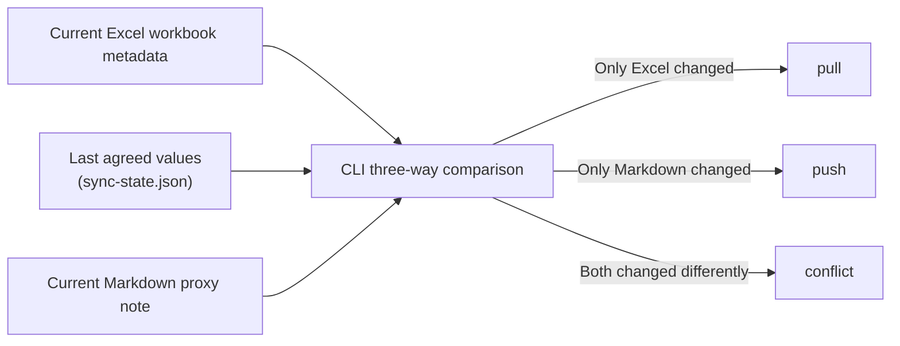

# Excel Catalog Pipeline

[日本語](README_ja.md)

`tkn-excel-catalog` projects `.xlsx` and `.xlsm` workbooks into Markdown proxy notes and
safely synchronizes selected metadata in both directions. Excel remains the source
workbook; Markdown is a searchable catalog entry and metadata editing surface.
Use `pull` to reflect Excel changes in Markdown and `push` to return Markdown changes
to Excel. The CLI uses the last agreed synchronization state to determine the change
direction and detect conflicts. Normal `pull`, `push`, and `adopt` execution performs
the changes named by the command; add `--dry-run` for a read-only preview. The tool
never deletes a workbook or proxy note.

For canvas-style notes, the optional `context build` command renders selected sheets
and adds AI-generated Markdown context. See “Visual sheet context” below.

## Requirements

- Windows or another Python 3.11+ platform
- [`uv`](https://docs.astral.sh/uv/)
- `.xlsx` or `.xlsm` source workbooks

Excel, Excel COM, and Obsidian are not required for metadata inspection. Obsidian is
only relevant when proxy-note renames must update backlinks.
Legacy `.xls` workbooks are outside the main CLI. See “Converting legacy `.xls`
workbooks” under “Specifications” for the desktop Excel conversion workflow.

## Install

For normal use, install the tool with the following command. Replace
`C:\path\to\tkn_excel_catalog_pipeline` with the actual repository folder.

```console
cd "C:\path\to\tkn_excel_catalog_pipeline"
uv tool install .
tkn-excel-catalog --help
```

This installs the current code, package resources, and dependencies into the
`uv`-managed tool environment. Later repository changes are not reflected
automatically. The final command verifies the CLI entry point. Use
`tkn-excel-catalog config show` to inspect the effective configuration and
`tkn-excel-catalog --version` to check the version.

Version `0.2.0` changes the execution boundary: optionless `pull`, `push`, and `adopt`
now write, while `--dry-run` is the only preview mode. Before reinstalling, update any
Task Scheduler task, shell script, or saved procedure that relied on the `0.1.x`
optionless dry run. The old `--write-notes` and `--write-excel` options remain accepted
for compatibility, perform the same normal write, and emit a
deprecation warning.

After `git pull` or another repository update, reinstall the tool:

```console
cd "C:\path\to\tkn_excel_catalog_pipeline"
uv tool install . --reinstall
tkn-excel-catalog --help
```

The executable was renamed from `excel-catalog` to `tkn-excel-catalog`. If an older
installation is present, the `--reinstall` command above updates the installed entry point.

`--reinstall` ensures that the updated code, package resources, and dependencies are
installed into the tool environment. `--force` forces the tool installation itself,
but does not guarantee that a package with the same version is rebuilt and reinstalled.

## Configure

### Create the configuration file

Create the user-wide configuration, then edit its example paths:

```console
tkn-excel-catalog config init
```

This creates `~/.tkn/excel_catalog_pipeline/config.yaml`. Re-running the command is
safe: an identical file is left unchanged, and an edited file is not overwritten.
`tkn-excel-catalog config init --force` explicitly replaces an existing edited file with
the template, so use it only when discarding those edits is intentional.

To begin using the CLI, replace `sources[].id`, `sources[].path`, and
`sources[].notes.root` with the values for your environment.

### Main settings

The main settings are:

| Setting | Meaning |
| --- | --- |
| `schema_version` | Configuration format version; keep `1`. |
| `sources[].id` | A user-chosen, unique, stable name for one Excel source. |
| `sources[].path` | Root folder containing the source Excel workbooks. |
| `sources[].recursive` | When `true`, scan subfolders. The default is `false`, which reads only the source root. |
| `sources[].include` | Glob patterns selecting workbooks at the scanned levels. |
| `sources[].ignore` | Source-root-relative glob patterns excluding files or folders. |
| `sources[].notes.root` | Proxy-note folder: `pull` writes here and `push` reads from here. |
| `sources[].notes.profile` | Note-format profile; keep `tkn-obsidian-v1` in the current version. |
| `sources[].notes.frontmatter_term_format` | Format for `keywords` and `categories`: `obsidian-link` (default) writes `[[term]]`; `plain` writes ordinary strings. |
| `sources[].notes.rename_adapter` | Controls rename and folder-move handling. The default `report-only` changes no paths; `filesystem` permits direct changes during normal execution as described below. |
| `sync.max_extracted_text_chars` | Maximum extracted workbook text stored in a proxy note. |

The remaining `sync` booleans document safety policy for future extension. The
current version always preserves unknown note metadata, never deletes files, and
still requires `push --allow-rename` before a workbook rename can be applied.

For Windows paths, YAML single quotes are recommended, for example
`'C:\path\to\excel-workbooks'`. Inside single quotes, backslashes do not need to be
doubled.

### Inspect the effective configuration

Configuration is merged in this order:

1. `~/.tkn/excel_catalog_pipeline/config.yaml`
2. `./.tkn/config.yaml`
3. a file passed with `--config`

Later files override earlier files. Individual command options have final precedence.
Relative paths are resolved from the current working directory. Inspect the effective
configuration without creating runtime files:

```console
tkn-excel-catalog config show
tkn-excel-catalog --config C:\path\to\config.yaml config show
```

The first line shows the full path of the highest-priority loaded config file.
The resolved configuration follows as indented JSON, with all loaded files listed
in `loadedConfigFiles` in merge order. If no config file exists, the first line
states that built-in defaults are used. The output includes a text header and is
intended for reading in the terminal.

### Example with subfolder scanning

Source IDs must be unique. The schema supports multiple roots; use `--source <id>` to
limit a run to one root.

This example enables subfolder scanning while excluding unwanted folders. Use `/` as the pattern separator on every OS. `ignore` applies to paths relative to `path`; exclude a whole folder with a pattern such as `archive/**`.

```yaml
sources:
  - id: personal-excel
    path: 'C:\path\to\excel-workbooks'
    recursive: true
    include:
      - "*.xlsx"
      - "*.xlsm"
    ignore:
      - "archive/**"
      - "**/Temp/**"
    notes:
      root: 'C:\path\to\obsidian-vault\reference\entities\files\Excel'
      profile: tkn-obsidian-v1
      frontmatter_term_format: obsidian-link
      rename_adapter: filesystem
```

With `recursive: true`, the proxy-note tree mirrors each workbook's source-relative parent folder. For example, `2008/example.xlsx` becomes `2008/example.xlsx.md` below the notes root and records `sourceFileName: 2008/example.xlsx`. After externally moving existing workbooks into year folders, run `pull --dry-run` first to review the plan and then run `pull` normally. Applying tracked proxy-note folder moves directly requires `rename_adapter: filesystem`.

See “Renames and folder moves” under “Specifications” for change directions, required
permissions, and Obsidian backlink considerations.

## Basic use

Optionless `pull`, `push`, and `adopt` perform their named changes. Add `--dry-run`
when you need a read-only preview first. Dry-run uses the same configuration, input
validation, three-way comparison, conflict checks, path checks, and protection rules,
but it writes no workbook, proxy note, synchronization state, cache, backup, or run
report. These commands use no network access, authentication, external service, or
generative AI in either mode.

### Check status

Inventory configured workbooks and proxy notes:

```console
tkn-excel-catalog status
```

### Reflect Excel changes in Markdown

Apply Excel-to-Markdown changes, or preview the same decision without writing:

```console
tkn-excel-catalog pull
tkn-excel-catalog pull --dry-run
```

Normal `pull` preserves metadata that appears to have been edited only in Markdown.
After reviewing the dry-run console output, use `--prefer-source` when Excel must be treated as
authoritative for every differing metadata field, including recovery from incorrect
historical synchronization state:

```console
tkn-excel-catalog pull --source example --prefer-source
tkn-excel-catalog pull --source example --prefer-source --dry-run
```

Add global `-v` before the subcommand to print each metadata comparison. The same full
values are written to `differences.csv`, one row per workbook field:

```console
tkn-excel-catalog -v pull --source example --prefer-source --dry-run
```

### Reflect Markdown changes in Excel

Apply Markdown-to-Excel metadata changes with a backup, or preview without writing:

```console
tkn-excel-catalog push
tkn-excel-catalog push --dry-run
```

See “Console output, statuses, and exit codes” under “Specifications” for status meanings.

### Limit the target

Limit a push to one proxy note:

```console
tkn-excel-catalog push --note example.xlsx.md
tkn-excel-catalog push --note example.xlsx.md --dry-run
```

### Assign workbook IDs

Assign missing stable workbook IDs. Normal execution changes only the OOXML custom
properties and creates a backup first; dry-run lists the targets without assigning IDs:

```console
tkn-excel-catalog adopt
tkn-excel-catalog adopt --dry-run
```

## Specifications

### Synchronization model and managed state

The CLI does not compare only Excel and Markdown. For every workbook and metadata
field, it compares these three inputs:



| Component | Role |
| --- | --- |
| Excel workbook | Holds the actual `.xlsx` / `.xlsm` data and its current OOXML metadata. |
| Markdown proxy note | Acts as the searchable catalog entry and the editing surface for metadata that `push` can return to Excel. |
| `~/.tkn/excel_catalog_pipeline/state/sync-state.json` | Application-owned synchronization state. It stores the workbook ID, source and note paths, and the `baseMetadata` values on which both sides last agreed. It is not a user metadata editing surface. |

For example, if only the Excel title changed since the last agreement, that field is
a `pull` candidate. If only Markdown changed, it is a `push` candidate. If both sides
changed from the previous value to different values, the result is a `conflict` rather
than an automatic overwrite. After normal execution, only fields whose Excel and
Markdown values actually agree become the new base in `sync-state.json`. A dry run
does not update this state. Per-run files such as `summary.json` and `differences.csv`
are execution reports, separate from the persistent synchronization state above.
Dry-run does not create these reports.

### Metadata contract

| Markdown proxy note | Excel core property                   |
| ------------------- | ------------------------------------- |
| `schemaVersion: "2.1"` | Current proxy-note Frontmatter contract; not workbook metadata |
| `title`           | Title                                 |
| `subject`         | Subject                               |
| `author`          | Author / creator as one string        |
| `keywords[]`      | Keywords / tags                       |
| `categories[]`    | Category / categories                 |
| `comments`        | Comments / description                |
| `sourceCreated`   | Created; source-owned and pull-only   |
| `sourceModified`  | Modified; source-owned and pull-only  |
| `sourceFileName`  | Source-root-relative workbook path; editing it requests an explicit rename or move |
| `sourceFullPath` | Generated absolute workbook path; replaces the body Workbook Path section, not a rename request |

`description` holds the proxy-note overview and is never pushed to Excel. The body
no longer has an Overview section. By
default, list values use quoted Obsidian links in Frontmatter. Set
`sources[].notes.frontmatter_term_format: plain` to write ordinary strings instead. Both
formats are serialized to Excel as plain terms joined by `; `. Commas remain part of a term. `sourceCreated` and `sourceModified` are
refreshed only by `pull`; `push` ignores and preserves their current note values.
Generated `type`, source timestamps, `date`, `updated`, and `noteId` values use plain,
unquoted YAML scalars. `schemaVersion` remains a quoted string.

Proxy notes are named `<workbook-name>.xlsx.md` or `<workbook-name>.xlsm.md`. Recursive discovery mirrors the source-relative folder structure below the notes root.
Generated body sections are enclosed by `excel-catalog` markers. Unknown Frontmatter
fields and text outside those markers are preserved, except for the explicitly retired
Overview and Workbook Path sections described below. Workbook core metadata and the stable
custom ID live in Frontmatter, so schema 2.0 no longer generates `## Excel Metadata` and
removes the legacy managed section on a normal note write.
Legacy proxy notes without `schemaVersion`, or with schema 1.0 `noun` / `nouns`, remain
readable. A normal note write adds the current profile version; a dry run does
not modify the note.

The generated Frontmatter contract and body structure, including `schemaVersion`,
headings, section order, and default description, are owned by the application profile at
`src/excel_catalog_pipeline/note_profiles/tkn-obsidian-v1/template.md`. It is shipped
as a package resource and is not a user configuration file. Python owns resource
loading and validation, dynamic workbook content, and safe marker replacement.

### Conflict detection and resolution

Synchronization uses field-level three-way comparison between the previous base,
current workbook, and current note. Different changes on both sides return exit code
`2`; no last-write-wins rule is applied. After review, `--prefer-source` or
`--prefer-note` can resolve that run explicitly.
During `pull`, `--prefer-source` also replaces note-side-only metadata differences with
the current workbook values. Without that explicit option, those note values are
preserved so that an ordinary pull cannot silently discard a Markdown edit.
After a partial `pull` or `push`, the base advances only for fields whose workbook and
proxy-note values actually agree. An unresolved change in the opposite direction is
kept for the next command instead of being marked as synchronized.

### Renames and folder moves

Renames and folder moves can originate in either direction, depending on where the user makes the change.

| Changed location | Request detected by the CLI | Files changed when authorized |
| --- | --- | --- |
| Rename or move a workbook in Explorer or another external tool, then run `pull` | Rename or move the proxy note to match the source-relative workbook path | Proxy note |
| Edit the proxy note Frontmatter `sourceFileName`, then run `push` | Rename or move the workbook within its source root | Workbook and proxy note |

`rename_adapter` specifies, for each source, whether the CLI may handle that request directly on the filesystem.

- `report-only`: The default. When a rename or folder move is required, the CLI changes no paths and records a `rename-required` action in console output and, outside dry-run, the run report.
- `filesystem`: Allows the CLI to rename or move a workbook or proxy note using ordinary filesystem operations without backlink maintenance.

Setting `filesystem` alone does not change files. A corresponding normal command must run.

| Direction | Required setting and command |
| --- | --- |
| Rename or move the workbook first, then make the proxy note follow it | `rename_adapter: filesystem` and normal `pull` |
| Edit `sourceFileName`, then rename or move the workbook and proxy note | `rename_adapter: filesystem` and normal `push --allow-rename` |

Add `--dry-run` to either command to validate and preview the same operation without moving files. For a push-side rename preview, retain `--allow-rename` so the CLI validates the requested destination exactly as normal execution would. `sync.allow_source_rename` is not used by the current rename authorization checks; use `rename_adapter` and the command options shown above.

The affected file, current source and note paths, and reason for a `rename-required` action are printed to stderr. Normal execution also records them in `~/.tkn/excel_catalog_pipeline/state/runs/<run-id>/actions.csv` and `details.json`. When `pull` needs to move a proxy note, `details.json` also contains the requested note path and collision information. For `push`, the requested relative path remains visible in the edited Frontmatter `sourceFileName`. Dry-run creates no report, so use `-v` when field-level preview detail is needed.

A rename target must be a valid, collision-free source-relative path that stays inside the source root and preserves the current workbook extension.
`filesystem` moves Markdown files directly and does not update Obsidian backlinks, which is why `report-only` is the default. If backlink maintenance matters, review the report and rename the note manually in Obsidian, or keep using `report-only` until an appropriate external adapter is available.

### Run reports and synchronization state

Run reports are stored under:

```text
~/.tkn/excel_catalog_pipeline/state/runs/<run-id>/
  summary.json
  actions.csv
  details.json
  differences.csv
```

Synchronization base state is `~/.tkn/excel_catalog_pipeline/state/sync-state.json`.
Backups are under the adjacent `backups/` directory. Normal `pull`, `push`, and `adopt`
runs create reports. Dry-run creates, updates, or deletes no persistent application
file: no workbook, note, synchronization state, cache, backup, or report. It may read
the configured local files and existing state to calculate an accurate preview. It
does not use network access, authentication, downloads, external services, or paid
computation, and it leaves no application temporary file behind.
The preview is a snapshot, not a guarantee that a later normal run will be identical.
Normal execution rereads the inputs and rechecks conflicts, collisions, signatures,
locks, and other protection conditions immediately before each applicable change.
Per-file report rows distinguish direction explicitly: `sourceToNoteFields` lists
workbook values to apply through `pull`, while `noteToSourceFields` lists proxy-note
values to apply through `push`. `changedFields` lists the fields applied or planned by
the command that produced the row.
`differences.csv` contains `baseValue`, `excelValue`, `noteValue`, the original
three-way `direction`, and the explicit `plannedDirection`. This makes empty-value
deletions and source-authoritative recovery reviewable without reading JSON.

### Workbook write safety

Workbook writes:

- support `.xlsx` and `.xlsm` only;
- create a backup before overwriting the workbook;
- build replacement OOXML under the application OS temporary directory;
- rewrite only selected OOXML metadata package entries;
- preserve VBA and unrelated ZIP entries;
- validate ZIP integrity and reread properties before and after overwriting;
- overwrite the existing file contents without replacing the file itself, preserving file identity and creation time across platforms;
- restore the backup contents and timestamps if overwriting or post-write validation fails;
- refuse digitally signed OOXML packages;
- fail when a locked source cannot be safely overwritten.

Encrypted workbooks, `.xls`, `.xlsb`, deletion synchronization, format conversion,
and workbook layout/shape semantics are outside the MVP. Extracted cell text is a
search aid, not a complete workbook representation.

### Converting legacy `.xls` workbooks

The optional Windows helper script uses desktop Excel to convert legacy `.xls`
workbooks before cataloging them. It keeps the source files, refuses to overwrite
existing output, saves VBA workbooks as `.xlsm`, and saves other workbooks as
`.xlsx`. Desktop Excel is required only for this conversion helper.

Normal execution converts the eligible workbooks. Add `-DryRun` to inspect and validate
the plan without creating an output directory or workbook:

```console
.\scripts\Convert-XlsToOpenXml.ps1 -SourcePath "C:\path\to\legacy-workbooks"
.\scripts\Convert-XlsToOpenXml.ps1 -SourcePath "C:\path\to\legacy-workbooks" -DryRun
```

`-SourcePath` identifies the folder containing the source `.xls` workbooks; it
does not select the output destination.
When `-OutputDirectory` is omitted, each converted workbook is saved next to its
source `.xls` workbook. Use `-OutputDirectory` to collect the results in another
folder or `-Recurse` to include subfolders. An explicitly selected output folder
is flat; duplicate output names are reported and not written. Progress is written
to stderr, followed by one short, summary-only JSON result on stdout. Only files
whose extension is exactly `.xls` are inspected; existing `.xlsx` and `.xlsm`
workbooks are ignored. Both modes start desktop Excel and open each source read-only
to detect VBA and the planned output format; macros, events, link updates, and alerts
remain disabled. The legacy `-Write` switch is accepted during the `0.2.x`
compatibility period as a deprecated no-op for normal execution.

### Console output, statuses, and exit codes

Human-readable progress goes to stderr as `[LEVEL] message`. Pull, push, and adopt end
with an indented summary containing status counts. Normal execution includes report
paths; dry-run explicitly shows that no persistent report was written. `pull` lists each
non-unchanged proxy-note result with its full `notePath` and relative `sourcePath`. For `push`, progress includes
the selected source configuration (`id`, workbook path, include patterns, and note
settings), one result line as each non-unchanged file result is determined, and an
indented final summary. Per-file lines use the note filename and relative `sourcePath`
instead of repeating the full note path. Unchanged files appear only as a count in the summary.
Synchronization commands do not append raw JSON to stdout. After normal execution, the
final summary displays the full `summary.json` path, and `details.json` plus the CSV
artifacts remain available in the displayed report folder. Dry-run displays planned
counts, targets, paths, reasons, and conflicts on stderr without creating these artifacts. `config show`
prints the active config file's full path followed by indented JSON. `-v` / `--verbose` adds per-field Excel,
Markdown, base, and planned-direction comparisons. Use `--quiet`, `--verbose`, or
`--no-color`; `NO_COLOR` is honored.

`status` groups counts by configured source. It lists only items that require attention,
such as untracked workbooks, untracked proxy notes, duplicate IDs, unsupported files, and
read errors. Tracked workbooks are reported as a count rather than listed individually.
Each attention category shows at most 20 relative paths; the run report contains the full
details.

Per-file `push` statuses:

| Status | Meaning |
| ------ | ------- |
| `unchanged` | The workbook and proxy note have no synchronized differences. Individual logs omit these files; the summary reports only the total. |
| `would-write` | Proxy-note changes are planned for the workbook. Dry-run mode has not written them yet. |
| `written` | The workbook write and post-write verification completed. |
| `missing-source` | No unique workbook matches the proxy note. No workbook is modified. |
| `pull-required` | The workbook has changes that should be reviewed through `pull`; `push` does not modify it. |
| `conflict` | The base, workbook, and proxy note comparison found a conflict. Review it before using `--prefer-note` or `--prefer-source`. |
| `duplicate-id` | More than one workbook has the same `TknExcelCatalogId`, so matching is ambiguous. |
| `rename-required` | A rename was requested but requires explicit permission or handling by the configured adapter. |
| `rename-error` | The rename target, collision checks, or related file operation failed. |
| `read-error` | Workbook or proxy-note discovery or reading failed. |
| `write-error` | The workbook write or post-write verification failed. The command rolls back where possible. |

`sourcePath` is relative to the selected source `path` shown at startup. This avoids
repeating the source root on every line and keeps reports usable if the source root moves.
A `missing-source` result has no matching workbook and therefore no `sourcePath`; its log
shows only the proxy-note filename.

- `0`: success
- `1`: execution, validation, or partial write error
- `2`: unresolved conflict
- `3`: configuration or selection error

## Development

```console
uv sync --locked
uv run pytest
uv run ruff check .
uv run mypy src
uv build
```

Tests use synthetic workbooks only. Do not add private paths, real workbook metadata,
credentials, or Vault content to fixtures or documentation.

## Visual sheet context (optional)

Version `0.3.0` adds `context build`. It turns an Excel canvas into a structured
Markdown section, using native Excel rendering plus cell and drawing text. Ordinary
`pull`, `push`, `adopt`, and `status` do not invoke AI. This is an opt-in operation:
select a workbook and one or more exact sheet names; there is no automatic bulk build.

Install the optional renderer dependencies (Windows, installed desktop Microsoft
Excel, and an installed/signed-in Codex CLI are required):

```console
cd "C:\path\to\tkn_excel_catalog_pipeline"
uv tool install ".[context]" --reinstall
tkn-excel-catalog context --help
```

Create the proxy with `pull` first, then list or select sheets:

```console
tkn-excel-catalog context sheets --source personal-excel --workbook "example.xlsx"
tkn-excel-catalog context build --source personal-excel --workbook "example.xlsx" --sheet "Solutions" --dry-run
tkn-excel-catalog context build --source personal-excel --workbook "example.xlsx" --sheet "Solutions"
tkn-excel-catalog context build --source personal-excel --workbook "example.xlsx" --sheet "Solutions" --sheet "Notes"
```

`--all-sheets` explicitly selects all visible sheets; hidden sheets require an exact
`--sheet` selection. Unsupported sheet types fail validation before AI runs. A
relative workbook path is resolved against the selected source; absolute paths must
still be inside that source and match its include/ignore rules. All selected sheets
are validated first and then processed sequentially, stopping at the first failure.
Successful earlier sheets remain available.

`--dry-run` checks the saved workbook, selection, existing note and cache/edit guards.
It creates no persistent files and does not start Excel, render, authenticate, or call
AI. Image count and token cost cannot be known until rendering/generation. `context
sheets` is also read-only. Context commands emit one compact JSON result on stdout
and readable progress and usage on stderr (`--quiet` suppresses informational logs).

### Saved-file capture and rendering

The workbook may remain open in Excel. Windows sharing permits reading the **last
saved file**, including when an ordinary file read is denied. Unsaved edits in the
Excel UI are not captured. A concurrent save detected during capture is rejected
with a retry message. A private temporary copy is opened in a separate Excel instance,
with macros, events and link updates disabled, and is closed without saving.
The temporary OOXML copy also disables recalculation and refresh-on-open. Excel 4
macro sheets and non-UTF-8 workbook/connection XML are rejected for rendering. The
original workbook and the user's Excel session are not modified or closed.

Content bounds include visible cells, merged cells and shapes, including objects
outside UsedRange or the existing print area. Overlapping tiles preserve detail and
are ordered top-to-bottom, then left-to-right; the model is instructed to interpret
regions in Z order. A bounded overview conveys overall placement (its PDF pages may
be joined). Very widely separated content is represented by detail tiles with
coordinates rather than an enormous blank overview. Detailed regions must render
as one page; unexpected pagination stops the build instead of silently omitting it.

The model receives only the selected sheet's images, extracted text and positions.
The first provider is Codex CLI; its configured model must accept image input.
The built-in profile uses `gpt-5.6-sol` with `medium` reasoning. This sends selected
sheet evidence to the signed-in Codex service. There is no automatic provider retry.
The result is an interpretation: small labels, ambiguous arrow endpoints, unsupported
embedded objects or unexplained colors can require review. The prompt asks the model
to state uncertainty and distinguish source statements from inference.

### Output, cache and edit protection

Each selected sheet gets an independent `context-<sheetId>` managed block in the
existing proxy. Frontmatter and text outside that block are preserved, including
other sheets' generated sections. Normal `pull` preserves these sections.

Images and structured evidence use this layout, relative to the proxy's directory:

```text
example.xlsx.md
img/
  <book-key>/sheet-<id>/<generation>/
    001.png
    002.png
    evidence.json
```

The fixed sibling `img` directory keeps links portable when moving the note together
with its assets. Nested proxy notes get their own sibling `img`. Generated identifiers
avoid collisions among workbooks and sheets. Old assets are retained; there is no
automatic deletion. PDFs and the source snapshot are temporary; PNGs and the evidence
manifest are durable. Do not commit real outputs or usage records to a public repo.

An unchanged sheet, matching configuration/prompt version, intact image files and
unchanged generated block produce a cache hit: no Excel rendering and no AI tokens.
The fingerprint covers the sheet's internal OOXML dependencies and shared styles;
a workbook-wide style change may therefore invalidate multiple sheets. Changes to
unrelated cell strings normally do not. `--force` explicitly regenerates and replaces
manual edits **inside selected context blocks**. Without it, modified generated text
or missing matching state blocks replacement. An edit made while generation is
running is detected before publication and preserved, even with `--force`.

State and usage records live under `~/.tkn/excel_catalog_pipeline/state/context/`,
separate from metadata sync state. Builds hold a per-note lock; after an abrupt
process termination, inspect the process before removing a reported stale lock.
If an AI call fails, times out, or produces invalid output, the existing note remains
unchanged. A later publication failure may leave unused assets, which are retained.

### Usage and configuration

Every AI invocation logs its reported input, output, cached input, reasoning tokens
and duration; the JSON result totals invocations in that run. Cached input is a
**subset of input**, and reasoning is a **subset of output**. They are not added again.
Only `turn.completed` usage deltas are summed; cumulative events are ignored.
Unavailable or interrupted usage is `unknown`/`null`, never an invented zero. Partial
known counts are retained in the usage JSON. Records contain usage/provenance, not
prompts, generated bodies, or credentials. Monetary cost is not estimated from tokens:
billing depends on the account and pricing. A cache hit reports zero calls/tokens.

The packaged example includes the `context` mapping. Existing configuration files
remain valid. Settings include `executable`, `model`, `reasoning_effort`, `language`,
`timeout_seconds` (AI invocation), `max_images` (including overview),
`tile_width_points`, `tile_height_points`, `overlap_points`, `image_dpi`, `max_cells`,
`max_objects`, `max_input_chars`, and `max_workbook_mb`. Limits fail explicitly instead
of truncating source content. Increase a relevant limit deliberately after inspection.
The image directory is intentionally fixed; no extra path configuration is needed.


## Import reviewed sheet Markdown without AI

Version `0.4.0` adds `context import`. Use it to preserve a previously written/reviewed
sheet interpretation exactly, with heading and image-link adjustments only. It does
not start Excel, render images, invoke Codex, or require the `[context]` extra.

```console
tkn-excel-catalog context import --source personal-excel --workbook "example.xlsx" --sheet "Solutions" --markdown "C:\path\to\Solutions.context.md" --dry-run
tkn-excel-catalog context import --source personal-excel --workbook "example.xlsx" --sheet "Solutions" --markdown "C:\path\to\Solutions.context.md"
```

The proxy must already exist. Input Markdown must have exactly one ATX H1 title;
H1 becomes `## <sheet> (sheetId: <id>)`, H2 becomes H3, and so on (input H6 is rejected).
Code fences and inline code remain source text. New context sections are placed
after Workbook Map and before Extracted Text. Existing blocks are replaced in place.

Relative inline/reference image links are copied into the proxy's sibling
`img/<book-key>/sheet-<id>/import-<hash>/` and rewritten to portable relative links.
Local images must exist within the input Markdown's directory tree; absolute paths,
path escapes and unsupported local file types are rejected. HTTP(S), mail and anchor
links are retained without fetching them. Source Markdown and images are unchanged.
Input Frontmatter remains provenance in `provenance.json`; it does not replace the
proxy's identity/metadata. Declared workbook/sheet identities are validated. A source
snapshot hash mismatch produces a warning and preserves the historical provenance.

The import writes a backup under the application's context state directory before
updating the proxy. An identical re-import is a no-op. Modified context text or images
requires explicit `--force` to replace/restore. Missing images can be restored by
re-importing. An imported section is protected from ordinary `context build`, even
when the workbook changes: the result is `retained`, with zero AI calls/tokens.
`context build --force` explicitly replaces it with fresh AI-generated content.
Dry-run validates without creating notes, images, backups, state or locks.

### Frontmatter layout 2.1

The profile now writes `schemaVersion: "2.1"`. New notes omit `## Overview` and
`## Workbook Path`. Normal note rendering during synchronization, and context import,
migrate these named legacy sections: Overview prose moves into `description` (appended
when an existing description differs), and the actual workbook path is written to
`sourceFullPath`. Known generic placeholder overviews are discarded. Path annotations
remain in the body. The legacy path section can still be read before migration.

`context import --description "..."` explicitly replaces the note description.
Otherwise the existing description and migrated overview prose are retained.
The import changes only `description`, `sourceFullPath`, and `schemaVersion` in proxy
Frontmatter; unrelated fields, comments, timestamps, IDs and text are preserved.
No bulk Vault migration is performed automatically: existing notes change only when
targeted by an import or a normal synchronization write. `description` remains separate
from Excel's `comments` property, and `sourceFileName` remains the rename request field.
