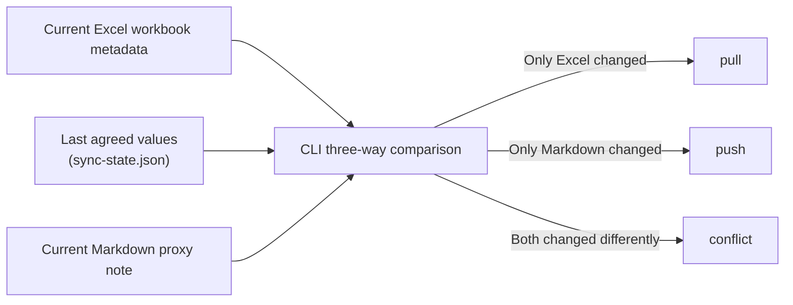

# Excel Catalog Pipeline

[日本語](README_ja.md)

`tkn-excel-catalog` projects `.xlsx` and `.xlsm` workbooks into Markdown proxy notes and
safely synchronizes selected metadata in both directions. Excel remains the source
workbook; Markdown is a searchable catalog entry and metadata editing surface.
Use `pull` to reflect Excel changes in Markdown and `push` to return Markdown changes
to Excel. The CLI uses the last agreed synchronization state to determine the change
direction and detect conflicts. Every mutating workflow defaults to a report-only dry
run, and the tool never deletes a workbook or proxy note.

## Requirements

- Windows or another Python 3.11+ platform
- [`uv`](https://docs.astral.sh/uv/)
- `.xlsx` or `.xlsm` source workbooks

Excel, Excel COM, and Obsidian are not required for metadata inspection. Obsidian is
only relevant when proxy-note renames must update backlinks.
Legacy `.xls` workbooks are outside the main CLI. See “Converting legacy `.xls`
workbooks” under “Specifications” for the desktop Excel conversion workflow.

## Install

For normal use, install the tool with the following command. Replace
`C:\path\to\tkn_excel_catalog_pipeline` with the actual repository folder.

```console
cd "C:\path\to\tkn_excel_catalog_pipeline"
uv tool install .
tkn-excel-catalog --help
```

This installs the current code, package resources, and dependencies into the
`uv`-managed tool environment. Later repository changes are not reflected
automatically. The final command verifies the CLI entry point. Use
`tkn-excel-catalog config show` to inspect the effective configuration and
`tkn-excel-catalog --version` to check the version.

After `git pull` or another repository update, reinstall the tool:

```console
cd "C:\path\to\tkn_excel_catalog_pipeline"
uv tool install . --reinstall
tkn-excel-catalog --help
```

The executable was renamed from `excel-catalog` to `tkn-excel-catalog`. If an older
installation is present, the `--reinstall` command above updates the installed entry point.

`--reinstall` ensures that the updated code, package resources, and dependencies are
installed into the tool environment. `--force` forces the tool installation itself,
but does not guarantee that a package with the same version is rebuilt and reinstalled.

## Configure

### Create the configuration file

Create the user-wide configuration, then edit its example paths:

```console
tkn-excel-catalog config init
```

This creates `~/.tkn/excel_catalog_pipeline/config.yaml`. Re-running the command is
safe: an identical file is left unchanged, and an edited file is not overwritten.
`tkn-excel-catalog config init --force` explicitly replaces an existing edited file with
the template, so use it only when discarding those edits is intentional.

To begin using the CLI, replace `sources[].id`, `sources[].path`, and
`sources[].notes.root` with the values for your environment.

### Main settings

The main settings are:

| Setting | Meaning |
| --- | --- |
| `schema_version` | Configuration format version; keep `1`. |
| `sources[].id` | A user-chosen, unique, stable name for one Excel source. |
| `sources[].path` | Root folder containing the source Excel workbooks. |
| `sources[].recursive` | When `true`, scan subfolders. The default is `false`, which reads only the source root. |
| `sources[].include` | Glob patterns selecting workbooks at the scanned levels. |
| `sources[].ignore` | Source-root-relative glob patterns excluding files or folders. |
| `sources[].notes.root` | Proxy-note folder: `pull` writes here and `push` reads from here. |
| `sources[].notes.profile` | Note-format profile; keep `tkn-obsidian-v1` in the current version. |
| `sources[].notes.frontmatter_term_format` | Format for `keywords` and `categories`: `obsidian-link` (default) writes `[[term]]`; `plain` writes ordinary strings. |
| `sources[].notes.rename_adapter` | Controls rename and folder-move handling. The default `report-only` changes no files; `filesystem` performs direct changes only with the explicit write options described below. |
| `sync.max_extracted_text_chars` | Maximum extracted workbook text stored in a proxy note. |

The remaining `sync` booleans document safety policy for future extension. The
current version always preserves unknown note metadata, never deletes files, and
still requires `push --write-excel --allow-rename` before a workbook rename can be
applied.

For Windows paths, YAML single quotes are recommended, for example
`'C:\path\to\excel-workbooks'`. Inside single quotes, backslashes do not need to be
doubled.

### Inspect the effective configuration

Configuration is merged in this order:

1. `~/.tkn/excel_catalog_pipeline/config.yaml`
2. `./.tkn/config.yaml`
3. a file passed with `--config`

Later files override earlier files. Individual command options have final precedence.
Relative paths are resolved from the current working directory. Inspect the effective
configuration without creating runtime files:

```console
tkn-excel-catalog config show
tkn-excel-catalog --config C:\path\to\config.yaml config show
```

### Example with subfolder scanning

Source IDs must be unique. The schema supports multiple roots; use `--source <id>` to
limit a run to one root.

This example enables subfolder scanning while excluding unwanted folders. Use `/` as the pattern separator on every OS. `ignore` applies to paths relative to `path`; exclude a whole folder with a pattern such as `archive/**`.

```yaml
sources:
  - id: personal-excel
    path: 'C:\path\to\excel-workbooks'
    recursive: true
    include:
      - "*.xlsx"
      - "*.xlsm"
    ignore:
      - "archive/**"
      - "**/Temp/**"
    notes:
      root: 'C:\path\to\obsidian-vault\reference\entities\files\Excel'
      profile: tkn-obsidian-v1
      frontmatter_term_format: obsidian-link
      rename_adapter: filesystem
```

With `recursive: true`, the proxy-note tree mirrors each workbook's source-relative parent folder. For example, `2008/example.xlsx` becomes `2008/example.xlsx.md` below the notes root and records `sourceFileName: 2008/example.xlsx`. After externally moving existing workbooks into year folders, run `pull` first to review the plan and then `pull --write-notes`. Applying tracked proxy-note folder moves directly requires `rename_adapter: filesystem`.

See “Renames and folder moves” under “Specifications” for change directions, required
permissions, and Obsidian backlink considerations.

## Basic use

Run mutating commands without write options first. Review the console summary and
report folder, then repeat the same command with its explicit write option only when
the plan matches your intent.

### Check status

Inventory configured workbooks and proxy notes:

```console
tkn-excel-catalog status
```

### Reflect Excel changes in Markdown

Plan Excel-to-Markdown changes, then apply reviewed note writes:

```console
tkn-excel-catalog pull
tkn-excel-catalog pull --write-notes
```

Normal `pull` preserves metadata that appears to have been edited only in Markdown.
After reviewing the dry-run report, use `--prefer-source` when Excel must be treated as
authoritative for every differing metadata field, including recovery from incorrect
historical synchronization state:

```console
tkn-excel-catalog pull --source example --prefer-source
tkn-excel-catalog pull --source example --prefer-source --write-notes
```

Add global `-v` before the subcommand to print each metadata comparison. The same full
values are written to `differences.csv`, one row per workbook field:

```console
tkn-excel-catalog -v pull --source example --prefer-source
```

### Reflect Markdown changes in Excel

Plan Markdown-to-Excel metadata changes, then apply reviewed workbook writes:

```console
tkn-excel-catalog push
tkn-excel-catalog push --write-excel
```

See “Console output, statuses, and exit codes” under “Specifications” for status meanings.

### Limit the target

Limit a push to one proxy note:

```console
tkn-excel-catalog push --note example.xlsx.md
tkn-excel-catalog push --note example.xlsx.md --write-excel
```

### Assign workbook IDs

Assign missing stable workbook IDs. This changes the OOXML custom properties only in
write mode and creates a backup first:

```console
tkn-excel-catalog adopt
tkn-excel-catalog adopt --write-excel
```

## Specifications

### Synchronization model and managed state

The CLI does not compare only Excel and Markdown. For every workbook and metadata
field, it compares these three inputs:



| Component | Role |
| --- | --- |
| Excel workbook | Holds the actual `.xlsx` / `.xlsm` data and its current OOXML metadata. |
| Markdown proxy note | Acts as the searchable catalog entry and the editing surface for metadata that `push` can return to Excel. |
| `~/.tkn/excel_catalog_pipeline/state/sync-state.json` | Application-owned synchronization state. It stores the workbook ID, source and note paths, and the `baseMetadata` values on which both sides last agreed. It is not a user metadata editing surface. |

For example, if only the Excel title changed since the last agreement, that field is
a `pull` candidate. If only Markdown changed, it is a `push` candidate. If both sides
changed from the previous value to different values, the result is a `conflict` rather
than an automatic overwrite. After an explicit write, only fields whose Excel and
Markdown values actually agree become the new base in `sync-state.json`. A dry run
does not update this state. Per-run files such as `summary.json` and `differences.csv`
are review reports, separate from the persistent synchronization state above.

### Metadata contract

| Markdown proxy note | Excel core property                   |
| ------------------- | ------------------------------------- |
| `schemaVersion: "2.0"` | Current proxy-note Frontmatter contract; not workbook metadata |
| `title`           | Title                                 |
| `subject`         | Subject                               |
| `author`          | Author / creator as one string        |
| `keywords[]`      | Keywords / tags                       |
| `categories[]`    | Category / categories                 |
| `comments`        | Comments / description                |
| `sourceCreated`   | Created; source-owned and pull-only   |
| `sourceModified`  | Modified; source-owned and pull-only  |
| `sourceFileName`  | Source-root-relative workbook path; editing it requests an explicit rename or move |

`description` is an optional proxy-note description and is never pushed to Excel. By
default, list values use quoted Obsidian links in Frontmatter. Set
`sources[].notes.frontmatter_term_format: plain` to write ordinary strings instead. Both
formats are serialized to Excel as plain terms joined by `; `. Commas remain part of a term. `sourceCreated` and `sourceModified` are
refreshed only by `pull`; `push` ignores and preserves their current note values.
Generated `type`, source timestamps, `date`, `updated`, and `noteId` values use plain,
unquoted YAML scalars. `schemaVersion` remains a quoted string.

Proxy notes are named `<workbook-name>.xlsx.md` or `<workbook-name>.xlsm.md`. Recursive discovery mirrors the source-relative folder structure below the notes root.
Generated body sections are enclosed by `excel-catalog` markers. Unknown Frontmatter
fields and text outside those markers are preserved. Workbook core metadata and the stable
custom ID live in Frontmatter, so schema 2.0 no longer generates `## Excel Metadata` and
removes the legacy managed section on an explicit note write.
Legacy proxy notes without `schemaVersion`, or with schema 1.0 `noun` / `nouns`, remain
readable. A reviewed, explicit note write adds the current profile version; a dry run does
not modify the note.

The generated Frontmatter contract and body structure, including `schemaVersion`,
headings, section order, and default description, are owned by the application profile at
`src/excel_catalog_pipeline/note_profiles/tkn-obsidian-v1/template.md`. It is shipped
as a package resource and is not a user configuration file. Python owns resource
loading and validation, dynamic workbook content, and safe marker replacement.

### Conflict detection and resolution

Synchronization uses field-level three-way comparison between the previous base,
current workbook, and current note. Different changes on both sides return exit code
`2`; no last-write-wins rule is applied. After review, `--prefer-source` or
`--prefer-note` can resolve that run explicitly.
During `pull`, `--prefer-source` also replaces note-side-only metadata differences with
the current workbook values. Without that explicit option, those note values are
preserved so that an ordinary pull cannot silently discard a Markdown edit.
After a partial `pull` or `push`, the base advances only for fields whose workbook and
proxy-note values actually agree. An unresolved change in the opposite direction is
kept for the next command instead of being marked as synchronized.

### Renames and folder moves

Renames and folder moves can originate in either direction, depending on where the user makes the change.

| Changed location | Request detected by the CLI | Files changed when authorized |
| --- | --- | --- |
| Rename or move a workbook in Explorer or another external tool, then run `pull` | Rename or move the proxy note to match the source-relative workbook path | Proxy note |
| Edit the proxy note Frontmatter `sourceFileName`, then run `push` | Rename or move the workbook within its source root | Workbook and proxy note |

`rename_adapter` specifies, for each source, whether the CLI may handle that request directly on the filesystem.

- `report-only`: The default. When a rename or folder move is required, the CLI changes no files and records a `rename-required` action in the run report.
- `filesystem`: Allows the CLI to rename or move a workbook or proxy note using ordinary filesystem operations without backlink maintenance.

Setting `filesystem` alone does not change files. The corresponding write options are also required.

| Direction | Required setting and command |
| --- | --- |
| Rename or move the workbook first, then make the proxy note follow it | `rename_adapter: filesystem` and `pull --write-notes` |
| Edit `sourceFileName`, then rename or move the workbook and proxy note | `rename_adapter: filesystem` and `push --write-excel --allow-rename` |

`pull` and `push` without write options remain dry runs. `sync.allow_source_rename` is not used by the current rename authorization checks; use `rename_adapter` and the command options shown above.

The affected file, current source and note paths, and reason for a `rename-required` action are recorded in `~/.tkn/excel_catalog_pipeline/state/runs/<run-id>/actions.csv` and `details.json`. When `pull` needs to move a proxy note, `details.json` also contains the requested note path and collision information. For `push`, the requested relative path remains visible in the edited Frontmatter `sourceFileName`. The CLI prints the report folder when the command finishes and, during `push`, also prints each `rename-required` result to stderr.

A rename target must be a valid, collision-free source-relative path that stays inside the source root and preserves the current workbook extension.
`filesystem` moves Markdown files directly and does not update Obsidian backlinks, which is why `report-only` is the default. If backlink maintenance matters, review the report and rename the note manually in Obsidian, or keep using `report-only` until an appropriate external adapter is available.

### Run reports and synchronization state

Run reports are stored under:

```text
~/.tkn/excel_catalog_pipeline/state/runs/<run-id>/
  summary.json
  actions.csv
  details.json
  differences.csv
```

Synchronization base state is `~/.tkn/excel_catalog_pipeline/state/sync-state.json`.
Backups are under the adjacent `backups/` directory. Dry runs may create reports, but
do not modify workbooks, notes, synchronization state, or cache.
Per-file report rows distinguish direction explicitly: `sourceToNoteFields` lists
workbook values to apply through `pull`, while `noteToSourceFields` lists proxy-note
values to apply through `push`. `changedFields` lists the fields applied or planned by
the command that produced the row.
`differences.csv` contains `baseValue`, `excelValue`, `noteValue`, the original
three-way `direction`, and the explicit `plannedDirection`. This makes empty-value
deletions and source-authoritative recovery reviewable without reading JSON.

### Workbook write safety

Workbook writes:

- support `.xlsx` and `.xlsm` only;
- create a backup before overwriting the workbook;
- build replacement OOXML under the application OS temporary directory;
- rewrite only selected OOXML metadata package entries;
- preserve VBA and unrelated ZIP entries;
- validate ZIP integrity and reread properties before and after overwriting;
- overwrite the existing file contents without replacing the file itself, preserving file identity and creation time across platforms;
- restore the backup contents and timestamps if overwriting or post-write validation fails;
- refuse digitally signed OOXML packages;
- fail when a locked source cannot be safely overwritten.

Encrypted workbooks, `.xls`, `.xlsb`, deletion synchronization, format conversion,
and workbook layout/shape semantics are outside the MVP. Extracted cell text is a
search aid, not a complete workbook representation.

### Converting legacy `.xls` workbooks

The optional Windows helper script uses desktop Excel to convert legacy `.xls`
workbooks before cataloging them. It keeps the source files, refuses to overwrite
existing output, saves VBA workbooks as `.xlsm`, and saves other workbooks as
`.xlsx`. Desktop Excel is required only for this conversion helper.

First inspect the plan, then repeat with the explicit write switch:

```console
.\scripts\Convert-XlsToOpenXml.ps1 -SourcePath "C:\path\to\legacy-workbooks"
.\scripts\Convert-XlsToOpenXml.ps1 -SourcePath "C:\path\to\legacy-workbooks" -Write
```

`-SourcePath` identifies the folder containing the source `.xls` workbooks; it
does not select the output destination.
When `-OutputDirectory` is omitted, each converted workbook is saved next to its
source `.xls` workbook. Use `-OutputDirectory` to collect the results in another
folder or `-Recurse` to include subfolders. An explicitly selected output folder
is flat; duplicate output names are reported and not written. Progress is written
to stderr, followed by one short, summary-only JSON result on stdout. Only files
whose extension is exactly `.xls` are inspected; existing `.xlsx` and `.xlsm`
workbooks are ignored.

### Console output, statuses, and exit codes

Human-readable progress goes to stderr as `[LEVEL] message`. Pull, push, and adopt end
with an indented summary containing status counts and report paths. `pull` lists each
non-unchanged proxy-note result with its full `notePath` and relative `sourcePath`. For `push`, progress includes
the selected source configuration (`id`, workbook path, include patterns, and note
settings), one result line as each non-unchanged file result is determined, and an
indented final summary. Per-file lines use the note filename and relative `sourcePath`
instead of repeating the full note path. Unchanged files appear only as a count in the summary.
Synchronization commands do not append raw JSON to stdout; the final summary displays the
full `summary.json` path, and `details.json` plus the CSV review artifacts remain available
in the displayed report folder. `config show`
continues to print its resolved configuration as JSON. `-v` / `--verbose` adds per-field Excel,
Markdown, base, and planned-direction comparisons. Use `--quiet`, `--verbose`, or
`--no-color`; `NO_COLOR` is honored.

`status` groups counts by configured source. It lists only items that require attention,
such as untracked workbooks, untracked proxy notes, duplicate IDs, unsupported files, and
read errors. Tracked workbooks are reported as a count rather than listed individually.
Each attention category shows at most 20 relative paths; the run report contains the full
details.

Per-file `push` statuses:

| Status | Meaning |
| ------ | ------- |
| `unchanged` | The workbook and proxy note have no synchronized differences. Individual logs omit these files; the summary reports only the total. |
| `would-write` | Proxy-note changes are planned for the workbook. Dry-run mode has not written them yet. |
| `written` | The workbook write and post-write verification completed. |
| `missing-source` | No unique workbook matches the proxy note. No workbook is modified. |
| `pull-required` | The workbook has changes that should be reviewed through `pull`; `push` does not modify it. |
| `conflict` | The base, workbook, and proxy note comparison found a conflict. Review it before using `--prefer-note` or `--prefer-source`. |
| `duplicate-id` | More than one workbook has the same `TknExcelCatalogId`, so matching is ambiguous. |
| `rename-required` | A rename was requested but requires explicit permission or handling by the configured adapter. |
| `rename-error` | The rename target, collision checks, or related file operation failed. |
| `read-error` | Workbook or proxy-note discovery or reading failed. |
| `write-error` | The workbook write or post-write verification failed. The command rolls back where possible. |

`sourcePath` is relative to the selected source `path` shown at startup. This avoids
repeating the source root on every line and keeps reports usable if the source root moves.
A `missing-source` result has no matching workbook and therefore no `sourcePath`; its log
shows only the proxy-note filename.

- `0`: success
- `1`: execution, validation, or partial write error
- `2`: unresolved conflict
- `3`: configuration or selection error

## Development

```console
uv sync --locked
uv run pytest
uv run ruff check .
uv run mypy src
uv build
```

Tests use synthetic workbooks only. Do not add private paths, real workbook metadata,
credentials, or Vault content to fixtures or documentation.
