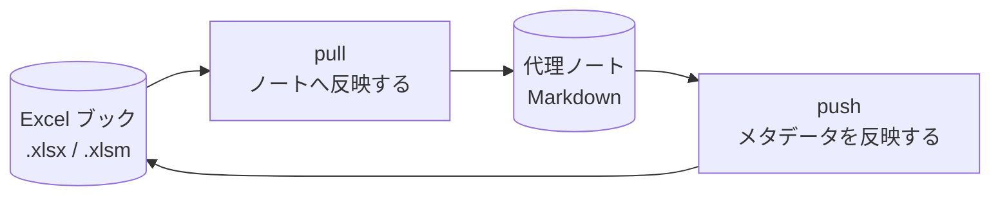

# tkn-excel-catalog: Tkn Excel Catalog Pipeline — Excel を Markdown で検索・整理する

Excel ブックを元の形式で保ちながら、内容の検索や分類に使う Markdown ノートを作成する CLI です。
作成されるノートには、`.xlsx` / `.xlsm` のタイトル・作成者などのメタデータ、シート一覧、セルから抽出した文字情報が記録されます。
これにより、ObsidianなどのMarkdown管理システムで、Excelを扱えるようになります。

また、ノート側で編集したメタデータを Excel へ一括して戻すこともできます。
Excelファイルに対し適切なメタデータを付与することで、Microsoft 365 における SharePoint検索、WorkIQ、Copilotの精度向上が見込めます。

初めて使う場合は、[対象範囲](#対象範囲)から[最初のノートを作成する](#最初のノートを作成する)まで順に進めてください。
導入後は[日常の更新](#日常の更新)と[コマンド一覧](#コマンド一覧)から必要な操作や詳しい手順を探せます。

## 全体の流れ

Excel と Markdown の間で、必要な方向のコマンドを実行します。

概要図を以下に示します。長方形は処理、円筒形は保存データ、矢印はデータの流れを表します。


```mermaid
flowchart LR
    Book[("Excel ブック<br/>.xlsx / .xlsm")]
    Pull["pull<br/>ノートへ反映する"]
    Note[("代理ノート<br/>Markdown")]
    Push["push<br/>メタデータを反映する"]

    Book --> Pull
    Pull --> Note
    Note --> Push
    Push --> Book
```

代理ノートは、元ブックを検索・分類するための Markdown ファイルです。
同期記録 `sync-state.json` はブックとノートの対応関係と前回一致した値を保持し、競合判定に使います。元ブックやノートとともに保全してください。詳しい比較の流れは[同期と実行結果](docs/reference/synchronization.md#比較から反映までの流れ)で確認できます。
`pull` と `push` は利用者が別々に実行します。セルや図形の内容を編集する場所は Excel です。
シートの説明文も加えたい場合は、任意の [`context build`](docs/guides/sheet-content.md#シートの内容をai解析してノートに追加する) で AI 生成し、`pull` で作成した代理ノートへ追加できます。

## 得られる結果

たとえば、`example.xlsx` に製品比較のシートがある場合、`pull` で `example.xlsx.md` を作成できます。
以下は生成ノートの内容を示す架空の抜粋です。実際のノートには識別子や管理用のマーカーも入ります。

```markdown
---
type: Excel
schemaVersion: "2.1"
title: 製品比較
subject: 次期モデルの検討
author: Example Author
keywords:
  - "[[製品比較]]"
sourceFileName: example.xlsx
---

# 製品比較

## Workbook Map

（シートの一覧）

## Extracted Text

（セルから抽出した比較項目や説明文）
```

ノートを Obsidian やテキスト検索で探し、`sourceFullPath` から元の Excel ファイルを確認できます。
ノート先頭の YAML 領域（Frontmatter）で `subject` や `keywords` を編集し、`push` で Excel のプロパティへ反映できます。

## 対象範囲

| 目的                                      | 操作                     | 得られるもの・変更対象                                 |
| ----------------------------------------- | ------------------------ | ------------------------------------------------------ |
| Excel を検索・分類する                    | `pull`                 | メタデータ、シート一覧、抽出文字を含む Markdown ノート |
| ノートで整理したメタデータを Excel に戻す | `push`                 | Excel のプロパティ更新とバックアップ                   |
| シートの配置や図形の意味も文章にする      | 任意の`context build`  | シート画像を使った AI の説明文と、その根拠画像         |
| ブックを単独の Markdown に変換する | 任意の `export` | 代理ノートとは別の Markdown と根拠画像 |

入力フォルダとノートの保存先を組にした設定が **source** です。
`--source` には、その組を識別する `sources` のキー（例: `catalog`）を指定します。

通常の同期はローカルで完結し、Excel 本体や Obsidian の起動、認証、ネットワーク通信、生成 AI を必要としません。
`context build` は選択シートの情報を、GenAI Bridge の共有プロファイルで選んだ接続先へ送信します。
利用条件は[AI によるシート説明](docs/guides/sheet-content.md#シートの内容をai解析してノートに追加する)で確認してください。

主 CLI の対象は `.xlsx` と `.xlsm` です。
暗号化ブック、`.xls`、`.xlsb`、削除の自動同期には対応しません。
元ブックがなくなった代理ノートは、専用の [`delete-notes`](docs/guides/catalog-operations.md#元ブックがない代理ノートを削除する) で削除できます。
セルの文字抽出は検索補助であり、書式・図形・配置を含むブック全体の完全な再現ではありません。
旧 `.xls` は、[変換用スクリプト](docs/guides/catalog-operations.md#旧-xls-を変換する)で別途変換できます。

## セットアップ

### 必要なもの

- Python 3.11 以上と `uv`。
- 入力にする `.xlsx` / `.xlsm` と、代理ノートを保存するフォルダ。
- このリポジトリのローカルコピー。

コマンドはターミナルで実行します。パスの例は Windows 用です。
PowerShell 固有の操作は、その手順で明記します。
基本の同期処理は Excel COM を使いませんが、この手順では他 OS 上の実動作確認までは扱いません。
デスクトップ版 Microsoft Excel は、任意の `context build` と旧 `.xls` の変換に必要です。

### インストールする

例示パスを、このリポジトリの実際の保存先へ置き換えて実行します。

```shell
cd "C:\path\to\tkn_excel_catalog_pipeline"
uv tool install .
tkn-excel-catalog --help
```

ヘルプが表示されれば、CLI の起動を確認できています。
Windows では、シート画像化に必要な Python 依存関係も通常のインストールに含まれます。
通常のインストールは、その時点のコードと同梱ファイルを `uv` のツール環境へ格納します。
リポジトリを編集しただけではインストール済み CLI に反映されません。
更新時の操作は[インストール済み CLI の更新](#インストール済み-cli-を更新する)を参照してください。

### 設定ファイルを作成する

ユーザー共通の設定ファイルを作成します。

```shell
tkn-excel-catalog config init
```

保存先は `~/.tkn/excel_catalog_pipeline/config.yaml` です。
`~` はユーザーのホームフォルダを表し、Windows では `$HOME` に相当します。
既存ファイルが同梱テンプレートと同じなら変更せず、編集済みなら上書きせず停止します。

### 入力と出力先を設定する

作成した設定をエディタで開きます。Windows の PowerShell では、次のように指定できます。

```shell
notepad "$HOME\.tkn\excel_catalog_pipeline\config.yaml"
```

以下は初回利用に必要な設定の最小例です。`config init` で作成したファイルの `sources` に反映してください。
2 つの `C:\path\to\...` を実際の入力フォルダとノート保存先へ置き換えます。Windows のパスは YAML のシングルクォートで囲むと、バックスラッシュを二重化せずに書けます。

```yaml
schema_version: "1.1.0"
sources:
  catalog:
    workbooks_dir: 'C:\path\to\excel-workbooks'
    notes:
      dir: 'C:\path\to\catalog-notes'
```

この例では、入力フォルダ直下の `.xlsx` / `.xlsm` が対象です。
サブフォルダも含める場合は[探索範囲の設定](docs/reference/configuration.md#探索範囲)で `recursive: true` を指定します。
`catalog` は任意の一意な設定名です。変更した場合は、以降の `--source catalog` も同じ名前にします。

### 読み込まれた設定を確認する

設定を保存し、入力・出力先が意図した値になっているか確認します。

```shell
tkn-excel-catalog config show
```

最も優先度が高い設定ファイルの絶対パスに続けて、解決済みの設定を JSON で表示します。
`loadedConfigFiles` は、実際に読み込んだ設定ファイルの一覧です。
作業フォルダに `.tkn/config.yaml` があるとユーザー共通設定より優先されるため、ここで対象パスを確認してください。
設定ファイルの優先順位は[設定リファレンス](docs/reference/configuration.md#設定ファイルの優先順位)を参照してください。

## 最初のノートを作成する

> [!IMPORTANT]
> 通常の `pull`、`push`、`adopt` は書き込みを行います。
> 変更せず予定を調べる場合は `--dry-run` を付けます。

最初は `pull` で代理ノートを作成します。この操作は元の Excel ファイルを変更しません。

まず、対象と作成予定のノートを確認します。

```shell
tkn-excel-catalog pull --source catalog --dry-run
```

新しいブックには `would-create` が表示されます。
対象パスが正しく、読み取りエラーや競合がなければ通常実行します。

```shell
tkn-excel-catalog pull --source catalog
```

`notes.dir` に `<ブック名>.xlsx.md` または `<ブック名>.xlsm.md` が作成されます。
たとえば `example.xlsx` には `example.xlsx.md` が対応します。
完了後は、次の点を確認してください。

1. 画面の集計で `created` または `updated` の件数を確認し、エラー・競合がないことを確かめます。
2. 表示された `notePath` のノートを開き、タイトル、`Workbook Map`、`Extracted Text` を確認します。
3. 詳細が必要な場合は、最後に表示された `summary.json` と同じフォルダの `actions.csv` を開きます。

差分がなければ `unchanged` になります。
対象が 0 件でも処理を終えるため、最初の実行でノートができない場合は `workbooks_dir`、`recursive`、`include`、`ignore` を見直してください。
終了コードだけで全対象の同期完了とは判断せず、[結果の読み方](docs/reference/synchronization.md#状態と次の操作)も確認します。

## 日常の更新

この CLI は呼び出したときに一度処理し、常駐監視はしません。
`--source` を省略した同期コマンドは、設定済みの全 source を対象にします。

### Excel 側の変更を取り込む

Excel を保存してから、代理ノートを更新します。

```shell
tkn-excel-catalog pull --source catalog
```

ノートだけで編集されたメタデータは保持します。
両方で同じ項目を別の値へ変更していた場合は、該当ブックを競合として報告します。
他の対象で成功した処理は残るため、全体が一括で取り消されるわけではありません。

### ノート側の変更を Excel に戻す

代理ノートの Frontmatter を編集し、対象を確認してから反映します。
以下の `example.xlsx.md` は、実際に作成されたノート名に置き換えます。

```shell
tkn-excel-catalog push --source catalog --note "example.xlsx.md" --dry-run
```

`would-write` の対象と差分を確認したら、書き込みます。

```shell
tkn-excel-catalog push --source catalog --note "example.xlsx.md"
```

元ブックをバックアップしてからプロパティを更新し、書き込み後に検証します。
反映できる項目は[メタデータの対応](docs/reference/synchronization.md#メタデータの対応)を参照してください。
`--note` は繰り返し指定でき、ノートのパス・名前、`sourceFileName`、`sourceId` で絞り込めます。
省略時は、選択した source の全代理ノートが対象です。

### 元ブックがない代理ノートを整理する

`delete-notes` は、元ブックが存在しないことを確認できた代理ノートだけを、バックアップ後に削除します。Excel ブックは削除しません。
削除前に対象と復旧方法を[代理ノートの削除手順](docs/guides/catalog-operations.md#元ブックがない代理ノートを削除する)で確認してください。

### 追跡状況を確認する

```shell
tkn-excel-catalog status --source catalog
```

未追跡のブックやノート、重複 ID、未対応ファイル、読み取りエラーを表示します。
ブックとノートは変更しませんが、実行レポートを保存します。
追跡済みブックは件数のみ、確認が必要な項目は分類ごとに最大 20 件の相対パスを表示します。
全件の詳細はレポートで確認できます。

### 再実行・中断後の確認

同期済みの内容は再実行で判定し直します。
通常実行では差分がなくても実行レポートを作成します。
`--dry-run` は設定・入力・既存の同期記録を読み、変更方向、競合、パス、保護条件を確認しますが、ブック、ノート、同期記録、キャッシュ、バックアップ、レポートを書きません。
アプリケーションの一時ファイルも残しません。

中断・失敗後は表示されたエラーとレポートを確認し、同じ対象を `--dry-run` で再確認します。
ロック、競合、権限などの原因を解消してから通常実行してください。
プレビューは確認した時点の状態なので、通常実行時には入力を読み直し、衝突や保護条件を再確認します。

## コマンド一覧

| 目的 | コマンド | 詳しい説明 |
| --- | --- | --- |
| 設定ファイルを作り、有効な設定を確認する | `config init` / `config show` | [セットアップ](#セットアップ)、[設定リファレンス](docs/reference/configuration.md) |
| ブックとノートの状況を確認する | `status` | [追跡状況](#追跡状況を確認する) |
| Excel の内容から代理ノートを作成・更新する | `pull` | [最初のノート](#最初のノートを作成する) |
| ノートのメタデータを Excel に戻す | `push` | [日常の更新](#ノート側の変更を-excel-に戻す) |
| ブックに固定 ID を付ける | `adopt` | [名前変更と移動](docs/reference/synchronization.md#名前変更と移動) |
| 元ブックのないノートを削除する | `delete-notes` | [削除手順と復旧](docs/guides/catalog-operations.md#元ブックがない代理ノートを削除する) |
| シート一覧を調べる | `workbook list-sheets` | [シート説明の手順](docs/guides/sheet-content.md) |
| シートの説明を生成する | `context build` | [シート説明の手順](docs/guides/sheet-content.md) |
| 1 ブックを単独の Markdown に変換する | `export` | [単独の Markdown への変換](docs/guides/sheet-content.md#excel-を単独の-markdown-に変換する) |

`pull`、`push`、`adopt`、`status`、`delete-notes` で `--source` を省略すると、設定済みの全 source が対象になります。`workbook list-sheets` と `context` の各コマンドでは source ID を明示します。
オプションの指定方法は `tkn-excel-catalog pull --help` のように確認できます。

## インストール済み CLI を更新する

リポジトリを更新した後は、インストール済みのコードと同梱ファイルを反映します。

```shell
cd "C:\path\to\tkn_excel_catalog_pipeline"
uv tool install . --reinstall
tkn-excel-catalog --version
```

AI によるシート説明や `export` を利用する場合は、接続先も[シート説明の手順](docs/guides/sheet-content.md)で確認してください。

## 詳しい情報

- [設定リファレンス](docs/reference/configuration.md): 入出力先、探索範囲、設定の優先順位。
- [同期と実行結果](docs/reference/synchronization.md): メタデータ、競合、名前変更、レポート、保存領域。
- [代理ノートの管理](docs/guides/catalog-operations.md): サムネイル、元ブックのないノートの削除と復旧、旧 `.xls` の変換。
- [シート説明と単独 Markdown の生成](docs/guides/sheet-content.md): AI 接続、シート説明の生成、`export`。
- [変更履歴](CHANGELOG.md): バージョンごとの変更内容。

## 開発と検証

開発用依存をそろえ、合成データでテストします。

```shell
cd "C:\path\to\tkn_excel_catalog_pipeline"
uv sync --locked
uv run pytest
uv run ruff check .
uv run mypy src
uv build
```

コード編集をツール環境へ反映しながら開発する場合は、通常のインストールと別に editable 方式を選べます。

```shell
uv tool install -e . --reinstall
```

依存関係、パッケージ情報、実行コマンドの定義を変更した場合は再インストールしてください。
テストには架空のブックだけを使い、個人の実パス、実ブックの情報、認証情報、Vault の内容を追加しません。

仕様を調べたり変更したりする場合は、次のファイルを入口にしてください。

| 対象                                   | 確認先                                                                                                                                                                  |
| -------------------------------------- | ----------------------------------------------------------------------------------------------------------------------------------------------------------------------- |
| コマンドと画面出力                     | [cli.py](src/excel_catalog_pipeline/cli.py)                                                                                                                              |
| 設定の検証と既定値                     | [config.py](src/excel_catalog_pipeline/config.py)、[models.py](src/excel_catalog_pipeline/models.py)、[同梱設定](src/excel_catalog_pipeline/resources/config.example.yaml) |
| 同期と競合判定                         | [pipeline.py](src/excel_catalog_pipeline/pipeline.py)                                                                                                                    |
| ノートの Frontmatter・見出し・節の順序 | [同梱テンプレート](src/excel_catalog_pipeline/note_profiles/tkn-obsidian-v1/template.md)                                                                                 |
| シート説明の生成                       | [context.py](src/excel_catalog_pipeline/context.py)                                                                                                                         |
| 検証例                                 | [tests](tests/)                                                                                                                                                          |
| 利用許諾                               | [LICENSE](LICENSE)                                                                                                                                                       |

ノートのテンプレートはパッケージに含める管理用ファイルです。ユーザー設定としては編集しません。
Python 側が動的なブック内容の生成、形式の検証、管理マーカーの置き換えを担当します。
