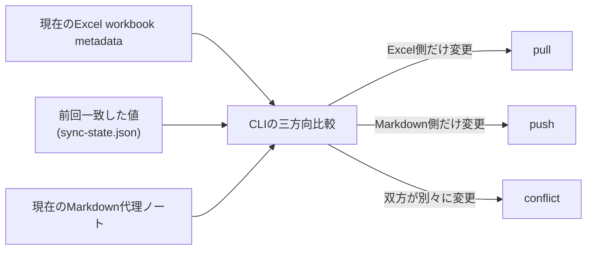

# Excel Catalog Pipeline

[English](README.md)

`tkn-excel-catalog`は、`.xlsx` / `.xlsm` workbookをMarkdown代理ノートへ投影し、
選択したmetadataを双方向に安全に同期するCLIです。Excelはsource workbookのまま、
Markdownを検索用catalog entry兼metadata編集面として使います。
ExcelからMarkdownへの反映は`pull`、MarkdownからExcelへの反映は`push`です。
前回両者が一致した同期stateを基準に変更方向とconflictを判定します。
通常の`pull`、`push`、`adopt`は、command名が表す変更を実行します。
read-only previewには`--dry-run`を明示します。workbookや代理ノートを自動削除しません。

キャンバス型のノートには、任意の`context build`コマンドでシートを画像化し、生成AIによる
Markdown本文を追加できます。後述の「シートの視覚的なcontextをMarkdown化する」を参照してください。

## 必要環境

- WindowsまたはPython 3.11以上が動く環境
- [`uv`](https://docs.astral.sh/uv/)
- `.xlsx`または`.xlsm`のsource workbook

metadataの検査にはExcel、Excel COM、Obsidianは不要です。Obsidianが関係するのは、
代理ノートrename時にbacklink更新が必要な場合だけです。
旧`.xls` workbookは主CLIの対象外です。desktop版Excelを使う変換方法は
「仕様」の「旧`.xls` workbookの変換」を参照してください。

## インストール

通常は、次のcommandでinstallします。例示している`C:\path\to\tkn_excel_catalog_pipeline`は、このrepositoryの実際のfolder pathへ置き換えてください。

```console
cd "C:\path\to\tkn_excel_catalog_pipeline"
uv tool install .
tkn-excel-catalog --help
```

このinstallationでは、install時点のcode、package resource、dependencyが`uv`の
tool環境へ格納され、repository内の変更は自動反映されません。最後のcommandは、
install後にCLI entry pointが動作することを確認します。現在の設定は
`tkn-excel-catalog config show`、versionは`tkn-excel-catalog --version`で確認できます。

version `0.2.0`で実行境界が変わります。optionなしの`pull`、`push`、`adopt`は
書き込みを行い、`--dry-run`だけがpreview modeです。再install前に、`0.1.x`の
optionなしdry-runへ依存しているTask Scheduler、shell script、保存済み手順を更新して
ください。旧`--write-notes`と`--write-excel`は互換性のため引き続き受け付け、通常実行と
同じ書き込みを行いますが、deprecation warningを表示します。

`git pull`などでrepositoryを更新した後は、次のcommandで再インストールします。

```console
cd "C:\path\to\tkn_excel_catalog_pipeline"
uv tool install . --reinstall
tkn-excel-catalog --help
```

実行名は`excel-catalog`から`tkn-excel-catalog`へ変更されました。旧versionをinstall済みの
場合は、上記の`--reinstall`付きcommandでinstall済みentry pointを更新できます。

`--reinstall`により、更新後のcode、package resource、dependencyをtool環境へ確実に
反映します。`--force`はtool installation自体を強制しますが、同じversionのpackageを
必ず再構築・再installするoptionではありません。

## 設定

### 設定fileを作成する

まずuser共通の設定fileを生成し、例示pathを書き換えます。

```console
tkn-excel-catalog config init
```

`~/.tkn/excel_catalog_pipeline/config.yaml`が作成されます。同じ内容のfileがある場合は
変更しないため、再実行しても安全です。編集済みのfileは上書きせずに停止します。
`tkn-excel-catalog config init --force`を指定するとtemplateで置き換えるため、既存の編集を
破棄するときだけ使用してください。

最初には`sources[].id`、`sources[].path`、`sources[].notes.root`を実際の値に
書き換えれば、基本操作を始められます。

### 主な設定項目

主な設定項目は次のとおりです。

| 設定 | 意味 |
| --- | --- |
| `schema_version` | 設定formatのversionです。`1`のまま使用します。 |
| `sources[].id` | Excel sourceを識別する、一意で安定した任意の名前です。 |
| `sources[].path` | source Excel fileを格納するroot folderです。 |
| `sources[].recursive` | `true`ならサブフォルダも探索します。未設定時の既定値は`false`で、root直下だけを読みます。 |
| `sources[].include` | 探索する階層で対象にするworkbookのglob patternです。 |
| `sources[].ignore` | source root基準で対象外にするfileまたはfolderのglob patternです。 |
| `sources[].notes.root` | 代理noteのfolderです。`pull`の出力先であり、`push`の入力元です。 |
| `sources[].notes.profile` | note形式のprofileです。現versionでは`tkn-obsidian-v1`のまま使用します。 |
| `sources[].notes.frontmatter_term_format` | `keywords`と`categories`の形式です。既定の`obsidian-link`は`[[term]]`、`plain`は通常文字列で出力します。 |
| `sources[].notes.rename_adapter` | rename・folder移動の処理方法です。既定の`report-only`はpathを変更せず、`filesystem`は後述の通常実行で直接変更を許可します。 |
| `sync.max_extracted_text_chars` | 代理noteへ保存するworkbook抽出textの最大文字数です。 |

その他の`sync`の真偽値は、将来の拡張に備えた安全方針です。現versionは未知のnote
metadataを常に保持し、fileを削除しません。workbook renameの適用には、設定とは別に
`push --allow-rename`も必要です。

Windows pathはYAMLのsingle quoteで囲む方法を推奨します。例:
`'C:\path\to\excel-workbooks'`。single quote内ではbackslashを`\\`へ二重化する必要は
ありません。

### 設定内容を確認する

設定は次の順で読み込まれます。

1. `~/.tkn/excel_catalog_pipeline/config.yaml`
2. `./.tkn/config.yaml`
3. `--config`で指定するfile

後の設定が前を上書きし、個別CLI optionが最優先です。相対pathはcurrent working
directory基準です。実行fileを作らず解決結果を確認できます。

```console
tkn-excel-catalog config show
tkn-excel-catalog --config C:\path\to\config.yaml config show
```

先頭行に、読み込んだ設定fileのうち最も優先順位が高いfileのフルパスを表示します。
続いて、解決済み設定をインデント付きJSONで表示します。`loadedConfigFiles`には
読み込んだ全fileを適用順で表示します。設定fileがない場合は、組み込み既定値を
使用していることを先頭行に明示します。出力はテキストの見出しを含む、端末で読むための形式です。

### サブfolderを読む設定例

source IDは一意である必要があります。schemaは複数rootを表現でき、`--source <id>`で
1つに限定できます。

サブフォルダを読み、不要なfolderを除外する設定例です。patternの区切りにはOSに関係なく`/`を使います。`ignore`は`path`からの相対pathに適用され、folder全体は`archive/**`のように指定できます。

```yaml
sources:
  - id: personal-excel
    path: 'C:\path\to\excel-workbooks'
    recursive: true
    include:
      - "*.xlsx"
      - "*.xlsm"
    ignore:
      - "archive/**"
      - "**/Temp/**"
    notes:
      root: 'C:\path\to\obsidian-vault\reference\entities\files\Excel'
      profile: tkn-obsidian-v1
      frontmatter_term_format: obsidian-link
      rename_adapter: filesystem
```

`recursive: true`では、source rootからの相対folderを代理note側にも再現します。例えば`2008/所有してきたCPUのベンチマーク比較.xlsx`は、notes rootの`2008/所有してきたCPUのベンチマーク比較.xlsx.md`となり、Frontmatterは`sourceFileName: 2008/所有してきたCPUのベンチマーク比較.xlsx`になります。既存workbookを年folderへ移動した後は、まず`pull --dry-run`で予定を確認し、review後に通常の`pull`を実行してください。追跡済み代理noteのfolder移動を直接適用するには`rename_adapter: filesystem`が必要です。

rename・folder移動の方向、許可option、Obsidian backlinkの注意点は、
「仕様」の「rename・folder移動」を参照してください。

## 基本操作

optionなしの`pull`、`push`、`adopt`は、command名が表す変更を実行します。
先にread-only previewが必要な場合は`--dry-run`を付けます。dry-runは通常実行と同じ設定解決、
入力validation、三方向比較、競合確認、path確認、保護条件を実行しますが、workbook、代理note、
同期state、cache、backup、run reportを書きません。どちらのmodeもnetwork access、認証、
外部service、生成AIを使用しません。

### 状態を確認する

設定したsource内のExcel workbookと代理ノートを走査し、追跡状況、重複ID、
読み取りエラーを確認:

```console
tkn-excel-catalog status
```

### ExcelからMarkdownへ反映する

ExcelからMarkdownへ反映、または同じ判定を変更なしでpreview:

```console
tkn-excel-catalog pull
tkn-excel-catalog pull --dry-run
```

通常の`pull`は、Markdownだけで編集されたように見えるmetadataを上書きせず保持します。
過去の誤った同期stateからの復旧など、Excelをすべての差分fieldの正とする場合は、
dry-runのconsole出力を確認してから`--prefer-source`を明示します。

```console
tkn-excel-catalog pull --source example --prefer-source
tkn-excel-catalog pull --source example --prefer-source --dry-run
```

subcommandの前にglobal option `-v`を付けると、metadataの比較値をfield単位で表示します。
通常実行では同じ完全な値を、workbookの1 fieldを1行とする`differences.csv`にも保存します。
dry-runではconsoleだけに表示します。

```console
tkn-excel-catalog -v pull --source example --prefer-source --dry-run
```

### MarkdownからExcelへ反映する

MarkdownからExcelへbackup付きで反映、または変更なしでpreview:

```console
tkn-excel-catalog push
tkn-excel-catalog push --dry-run
```

各statusの意味と終了codeは、「仕様」の「console出力、status、終了code」を
参照してください。

### 対象を限定する

特定ノートだけを対象にする例:

```console
tkn-excel-catalog push --note example.xlsx.md
tkn-excel-catalog push --note example.xlsx.md --dry-run
```

### workbook IDを付与する

stable workbook IDをcustom propertyへ付与します。dry-runでは付与対象だけを表示します:

```console
tkn-excel-catalog adopt
tkn-excel-catalog adopt --dry-run
```

## 仕様

### 同期modelと管理state

このCLIはExcelとMarkdownの二者だけを比較するのではなく、次の3つを
workbookごと、metadata fieldごとに比較します。



| 構成要素 | 役割 |
| --- | --- |
| Excel workbook | 実データである`.xlsx` / `.xlsm`と、現在のOOXML metadataを保持します。 |
| Markdown代理ノート | workbookの検索用catalog entryであり、`push`でExcelへ戻すmetadataの編集面です。 |
| `~/.tkn/excel_catalog_pipeline/state/sync-state.json` | CLIが管理する同期stateです。workbook ID、source / note path、前回両者が一致した`baseMetadata`などを保持します。userがmetadataを編集するfileではありません。 |

例えば、前回一致したtitleだけをExcel側で変更した場合は`pull`、
Markdown側だけで変更した場合は`push`の対象です。両方が前回値から
別々の値へ変わった場合は`conflict`とし、勝手に上書きしません。
通常実行後は、ExcelとMarkdownが実際に一致したfieldだけを新しい
baseとして`sync-state.json`へ記録します。dry-runはこのstateを更新しません。
runごとの`summary.json`や`differences.csv`は実行reportであり、上記の継続的な
同期stateとは別です。dry-runはこれらのreportも作成しません。

### metadata契約

| Markdown代理ノート | Excel core property            |
| ------------------ | ------------------------------ |
| `schemaVersion: "2.1"` | 現行の代理note Frontmatter契約。workbook metadataではない |
| `title`          | Title                          |
| `subject`        | Subject                        |
| `author`         | Author / creatorを単一文字列で保持 |
| `keywords[]`     | Keywords / tags                |
| `categories[]`   | Category / categories          |
| `comments`       | Comments / description         |
| `sourceCreated`  | Created。source-ownedかつpull専用 |
| `sourceModified` | Modified。source-ownedかつpull専用 |
| `sourceFileName` | source root基準の相対workbook path。編集時は明示rename/move要求 |
| `sourceFullPath` | 生成するworkbookの絶対パス。本文Workbook Pathの移行先であり、rename要求には使わない |

`description`は代理ノート全体の概要で、Excelへpushしません。本文のOverviewは廃止します。Frontmatterのlist値は
既定ではquote付きObsidian linkとして保持します。通常文字列にする場合は
`sources[].notes.frontmatter_term_format: plain`を設定します。どちらの形式もExcelへは
link記法を含まないtermとして`; `で結合します。
commaはtermの一部として保持します。`sourceCreated`と`sourceModified`は`pull`でのみ
更新し、`push`では現在のnote値を無視・保持します。
生成する`type`、source日時、`date`、`updated`、`noteId`の値はquoteなしのplain YAML
scalarとし、`schemaVersion`はquote付き文字列のまま保持します。

代理ノート名は`<workbook-name>.xlsx.md`または`<workbook-name>.xlsm.md`です。再帰探索時はsourceの相対folder構造をnotes root配下に再現します。生成管理する
本文sectionは`excel-catalog` markerで囲みます。未知のFrontmatter fieldとmarker外の
手書き本文は保持します。ただし、廃止するOverview・Workbook Pathは後述のとおり明示的に移行します。workbook core metadataとstable custom IDはFrontmatterに置くため、
schema 2.0では`## Excel Metadata`を生成せず、通常のnote書込み時に旧managed sectionを
削除します。
`schemaVersion`がない、またはschema 1.0の`noun` / `nouns`を使うlegacy代理noteも
引き続き読めます。通常のnote書込みで現profileのversionを追加し、dry-runでは
noteを変更しません。

生成Frontmatter契約と本文構造（`schemaVersion`、見出し、section順、default description）は、application-owned profile
`src/excel_catalog_pipeline/note_profiles/tkn-obsidian-v1/template.md`をsource of truthとします。
このfileはpackage resourceとして配布し、user設定にはしません。Pythonはresourceの読込と
validation、動的なworkbook内容の生成、安全なmarker置換を担当します。

### conflictの判定と解決

前回一致時のbase、現在のworkbook、現在のnoteをfield単位で三方向比較します。双方が
異なる値へ変わった場合は終了code `2`で停止し、mtimeによるlast-write-winsは行いません。
review後に`--prefer-source`または`--prefer-note`を明示できます。
`pull`の`--prefer-source`は、note側だけが変更されたと判定されたmetadataも現在のworkbook値で
置き換えます。このoptionがない通常の`pull`では、Markdown編集の黙示的な破棄を防ぐため、
そのnote値を保持します。
部分的な`pull`または`push`の後は、workbookと代理noteが実際に一致したfieldだけbaseを
更新します。反対方向に残る未同期変更は同期済みにせず、次のcommandへ引き継ぎます。

### rename・folder移動

rename・folder移動は、変更した場所によって次の2方向があります。

| 変更した場所 | CLIが検出する要求 | 許可時にCLIが変更する対象 |
| --- | --- | --- |
| Explorerなどでworkbookをrename・移動した後に`pull` | sourceの相対pathに合わせた代理noteのrename・移動 | 代理note |
| 代理noteのFrontmatter `sourceFileName`を編集した後に`push` | source root内でのworkbookのrename・移動 | workbookと代理note |

`rename_adapter`は、この要求をfilesystem上で直接処理してよいかをsource単位で指定します。

- `report-only`: 既定値です。rename・folder移動が必要でもpathを変更せず、actionを`rename-required`としてconsoleへ表示し、dry-run以外ではrun reportにも記録します。
- `filesystem`: backlink更新を伴わない通常のfilesystem操作で、workbookまたは代理noteを直接rename・移動できるようにします。

`filesystem`を設定しただけではfileは変更されません。対応する通常commandの実行が必要です。

| 方向 | 必要な設定とcommand |
| --- | --- |
| workbookを先にrename・移動し、代理noteを追従させる | `rename_adapter: filesystem`と通常の`pull` |
| `sourceFileName`を編集し、workbookと代理noteをrename・移動する | `rename_adapter: filesystem`と通常の`push --allow-rename` |

同じ操作をfile移動なしで検証・previewするには`--dry-run`を付けます。push側のrename previewでも`--allow-rename`を残すことで、通常実行と同じrename先validationを行います。`sync.allow_source_rename`は現versionのrename許可判定には使用されないため、上記の`rename_adapter`とcommand optionを使用してください。

`rename-required`の対象、現在のsource path・note path、理由はstderrへ表示します。通常実行では`~/.tkn/excel_catalog_pipeline/state/runs/<run-id>/actions.csv`と`details.json`にも記録します。`pull`で代理noteの移動が必要な場合は、希望するnote pathと衝突情報も`details.json`に入ります。`push`側の希望する相対pathは編集したFrontmatter `sourceFileName`で確認します。dry-runはreportを作成しないため、field単位のpreviewが必要な場合は`-v`を使います。

rename先はsource root内に収まり、現在と同じ拡張子で、Windows上有効かつ衝突しない相対pathである必要があります。
`filesystem`はMarkdown fileを直接移動し、Obsidian backlinkを更新しません。そのため既定値は`report-only`です。backlink更新が必要なVaultではreportを確認し、Obsidian上で手動renameするか、対応する外部adapterが追加されるまで`report-only`を使用してください。

### run reportと同期state

run report:

```text
~/.tkn/excel_catalog_pipeline/state/runs/<run-id>/
  summary.json
  actions.csv
  details.json
  differences.csv
```

base stateは`~/.tkn/excel_catalog_pipeline/state/sync-state.json`、backupは隣接する
`backups/`です。通常の`pull`、`push`、`adopt`はrun reportを作成します。dry-runは、
workbook、note、同期state、cache、backup、reportを含むapplicationの永続fileを作成、
更新、削除しません。正確なpreviewに必要な設定local fileと既存stateは読み取ります。
network access、認証、download、外部service、課金処理は使用せず、applicationの一時fileも
残しません。previewはその時点のsnapshotであり、後の通常実行との完全一致は保証しません。
通常実行は入力を読み直し、各変更の直前にconflict、collision、signature、lockなどの
保護条件を再確認します。
file別reportでは、`sourceToNoteFields`が`pull`でworkbookから代理noteへ反映するfield、
`noteToSourceFields`が`push`で代理noteからworkbookへ反映するfieldを示します。
`changedFields`は、そのreportを作成したcommandが反映または反映予定としたfieldです。
`differences.csv`には`baseValue`、`excelValue`、`noteValue`、元の三方向判定
`direction`、明示操作による`plannedDirection`を記録します。JSONを読まなくても、
空欄による削除やExcelを正とした復旧内容を確認できます。

### workbook writeの安全性

書き込みは次の契約です。

- `.xlsx` / `.xlsm`だけを正式対応する。
- workbookの上書き前にbackupする。
- application用のOS一時directoryで置換用OOXMLを構築する。
- 選択したOOXML metadata entryだけを書き換える。
- VBAと無関係なZIP entryを保持する。
- 上書き前後にZIP integrityとmetadataを再検証する。
- file自体を置換せず既存fileの内容だけを上書きし、OSを問わずfile identityと作成日時を保持する。
- 上書きまたは書き込み後検証に失敗した場合は、backupの内容と日時を復元する。
- digital signature付きOOXML packageはwrite拒否する。
- lock中sourceを安全に上書きできなければ失敗にする。

暗号化workbook、`.xls`、`.xlsb`、削除同期、format変換、図形や二次元layoutの意味解析は
MVP対象外です。cell text抽出は検索補助であり、内容の完全表現ではありません。

### 旧`.xls` workbookの変換

Windows用の補佐scriptはdesktop版Excelを使い、旧`.xls` workbookをcatalogへ取り込む前に
変換します。元fileは残し、既存の変換先を上書きしません。VBAを含むworkbookは`.xlsm`、
それ以外は`.xlsx`として保存します。desktop版Excelが必要なのは、この変換scriptだけです。

通常実行は対象workbookを変換します。出力folderやworkbookを作らずに予定を検証する場合は
`-DryRun`を付けます。

```console
.\scripts\Convert-XlsToOpenXml.ps1 -SourcePath "C:\path\to\legacy-workbooks"
.\scripts\Convert-XlsToOpenXml.ps1 -SourcePath "C:\path\to\legacy-workbooks" -DryRun
```

`-SourcePath`は、変換元の`.xls`があるfolderを指定する引数であり、出力先の指定では
ありません。
`-OutputDirectory`を省略すると、変換後のworkbookは各`.xls`と同じfolderへ作成されます。
別folderへまとめて出力する場合は`-OutputDirectory`、サブfolderも対象にする場合は
`-Recurse`を指定します。明示した出力先は単一folderとなるため、同名の変換先は
collisionとして報告し、書き込みません。進捗はstderr、最後のcompact JSON resultは
集計だけを含む短い1件としてstdoutへ出力します。拡張子が厳密に`.xls`のfileだけを
検査し、既存の`.xlsx`と`.xlsm`は対象外とします。どちらのmodeもdesktop版Excelを起動し、
VBAと出力形式の判定のためsourceをread-onlyで開きます。macro、event、link更新、alertは
無効のままです。旧`-Write`は`0.2.x`の互換期間中、通常実行のdeprecated no-opとして
受け付けます。

### console出力、status、終了code

人向け進捗はstderrへ`[LEVEL] message`として出します。pull、push、adoptの最後には、
status件数をindent付きsummaryで表示します。通常実行はreport pathを含み、dry-runは
永続reportを作成しなかったことを明示します。`pull`では、`unchanged`以外の
代理noteごとに、絶対pathの`notePath`と相対`sourcePath`を表示します。`push`では、処理対象のsource ID、
workbook path、include pattern、notes設定を最初に表示します。その後、`unchanged`以外の
fileごとの結果を確定するたびに、noteのfile nameと相対`sourcePath`を表示し、最後に
indent付きのsummaryを表示します。`unchanged`は個別表示せず、最終summaryに総数だけを表示します。
同期commandはstdoutの末尾にraw JSONを追加しません。通常実行の最終summaryには`summary.json`の
絶対pathを表示し、`details.json`とCSV artifactも、表示されたreport folderへ保存します。
dry-runは予定件数、対象、path、理由、conflictをstderrへ表示し、artifactを作成しません。`config show`は解決済み設定を
有効な設定fileのフルパスに続けてインデント付きJSONで表示します。`-v` / `--verbose`では、fieldごとのExcel値、
Markdown値、base値、適用方向も表示します。`--quiet`、`--verbose`、`--no-color`を提供し、
`NO_COLOR`も尊重します。

`status`は、設定したsourceごとに件数をまとめ、未追跡workbook、未追跡代理ノート、
重複ID、未対応file、読み取りエラーなど、確認が必要な項目だけを一覧表示します。
追跡済みworkbookは個別表示せず、件数だけを表示します。確認項目の相対pathは分類ごとに
最大20件を表示し、全件の詳細はrun reportに保存します。

`push`のfile別status:

| status | 意味 |
| ------ | ---- |
| `unchanged` | workbookと代理ノートに同期対象の差分がありません。個別ログには表示せず、summaryに総数だけを表示します。 |
| `would-write` | 代理ノート側の変更をworkbookへ書き込む予定です。dry-runのため、まだ書き込んでいません。 |
| `written` | workbookへの書き込みと検証が完了しました。 |
| `missing-source` | 代理ノートに一意に対応するworkbookが見つかりません。workbookは変更しません。 |
| `pull-required` | workbook側に取り込むべき変更があります。`push`では変更せず、`pull`で確認します。 |
| `conflict` | base、workbook、代理ノートの比較で競合しました。内容を確認し、必要な場合だけ`--prefer-note`または`--prefer-source`を指定します。 |
| `duplicate-id` | 同じ`TknExcelCatalogId`を持つworkbookが複数あり、一意に対応付けできません。 |
| `rename-required` | rename要求がありますが、明示許可または設定されたadapterでの処理が必要です。 |
| `rename-error` | rename先の名前、衝突、または関連fileの処理で問題が発生しました。 |
| `read-error` | workbookまたは代理ノートの検出・読み取りに失敗しました。 |
| `write-error` | workbookへの書き込みまたは書き込み後の検証に失敗しました。可能な範囲でrollbackします。 |

`sourcePath`は、開始時に表示される選択sourceの`path`を基準にした相対pathです。
root pathを各行で繰り返さず、reportをsourceの移動に対して扱いやすくするためです。
`missing-source`は対応するworkbook自体がないため`sourcePath`を持たず、ログには代理ノートの
file nameだけを表示します。

- `0`: 成功
- `1`: 実行・validation・partial write error
- `2`: 未解決conflict
- `3`: 設定または対象選択error

## 開発と検証

```console
uv sync --locked
uv run pytest
uv run ruff check .
uv run mypy src
uv build
```

testはsynthetic workbookだけを使用します。private path、実workbook metadata、credential、
Vault内容をfixtureや文書へ追加しないでください。

## シートの視覚的なcontextをMarkdown化する（任意）

`0.3.0`で`context build`を追加しました。Excelによる描画と、セル・図形の文字情報を組み合わせ、
Excelをキャンバスとして使ったノートの内容をMarkdownにまとめます。通常の`pull`、`push`、
`adopt`、`status`から生成AIは呼びません。対象ブックとシートを明示して実行します。

Windows、デスクトップ版Microsoft Excel、インストール・ログイン済みのCodex CLIが必要です。
画像化用の任意依存パッケージを含めてインストールします。

```console
cd "C:\path\to\tkn_excel_catalog_pipeline"
uv tool install ".[context]" --reinstall
tkn-excel-catalog context --help
```

まず`pull`でproxy noteを作成してください。シート名の一覧、書き込みなしの事前確認、生成は次のように実行します。

```console
tkn-excel-catalog context sheets --source personal-excel --workbook "example.xlsx"
tkn-excel-catalog context build --source personal-excel --workbook "example.xlsx" --sheet "Solutions" --dry-run
tkn-excel-catalog context build --source personal-excel --workbook "example.xlsx" --sheet "Solutions"
tkn-excel-catalog context build --source personal-excel --workbook "example.xlsx" --sheet "Solutions" --sheet "Notes"
```

`--sheet`は完全一致の名前で複数指定できます。`--all-sheets`は表示中の全シートを明示的に選択します。
非表示シートは`--sheet`で名前を指定した場合だけ対象です。未対応のシート種別はAIを呼ぶ前にエラーにします。
ブックの相対パスは選択したsourceのrootを基準に解決します。絶対パスでも、そのsource内にあり、
include/ignoreの条件を満たす必要があります。選択した全シートの事前検証後、1シートずつ処理し、
最初のエラーで停止します。それまでに成功したシートの結果は残ります。

`--dry-run`は保存済みブック、シート選択、既存ノート、cache・手動編集の状態を確認します。
永続ファイルを作成せず、Excelの起動、画像化、認証、AI呼び出しも行いません。
画像数やtoken数は実際の描画・生成前には確定できません。`context sheets`も読み取り専用です。
contextコマンドはstdoutに1つのcompact JSON、stderrに進捗・tokenのログを出します。
`--quiet`では情報ログを省略します。

### 開いているExcelと画像化

Excelを開いたまま実行できます。通常のファイル読み取りが拒否される場合でも、Windowsの共有読み取りで
**最後に保存されたファイル**を取得します。Excel画面上の未保存の編集は含みません。
取得中に保存による変更を検出した場合は、中途半端なsnapshotを使わず再実行を案内します。
一時コピーを別のExcelインスタンスで開き、マクロ・イベント・リンク更新を無効にして描画し、
保存せず閉じます。一時コピー側では自動再計算と起動時の外部データ更新も抑止します。
Excel 4マクロシートや、UTF-8以外で保存されたブック・接続情報のXMLは画像化の対象外です。
元ブックやユーザーが開いているExcelを変更・終了しません。

表示中のセル、結合セル、図形の位置から描画範囲を決めます。UsedRangeや既存の印刷範囲の外にある図形も
対象です。詳細は一部が重なる画像に分割し、上から下、同じ高さでは左から右に並べます。
AIには領域内をZ字の順で読み、矢印・色・配置の意味を解釈するよう指示します。
適切なサイズの全体図も付けます。全体図のPDFが複数ページになる場合は連結します。
極端に離れた領域は巨大な空白画像を作らず、座標付きの詳細画像として扱います。
詳細領域が想定外に複数ページになった場合は、欠落を黙認せず停止します。

AIに渡すのは選択シートの画像、文字、位置情報です。初期実装はCodex CLIを使用し、
画像入力に対応するモデルを指定します。既定は`gpt-5.6-sol`、推論量は`medium`です。
選択シートの情報はログイン先のCodexサービスに送られます。AI呼び出しの自動再試行は行いません。
小さな文字、曖昧な矢印の先端、未対応の埋め込みオブジェクト、説明のない色の意味などは、確認が必要な場合があります。
AIには原文の記述と推測を区別し、不明点を明記するよう指示します。

### 保存先、再実行、手動編集の保護

既存proxy noteにシートごとの`context-<sheetId>`管理セクションを追加します。
Frontmatter、管理セクション外の文章、他シートの生成結果を保持します。通常の`pull`もこのセクションを保持します。

画像と抽出根拠は、Markdownと同階層の`img`以下に保存します。Markdown内のリンクは相対パスです。

```text
example.xlsx.md
img/
  <book-key>/sheet-<id>/<generation>/
    001.png
    002.png
    evidence.json
```

ノートと`img`を一緒に移動すれば、リンクを維持できます。サブフォルダ内のノートにも、そのノートと同階層の
`img`を使います。識別子によりブック・シート間の名前衝突を防ぎます。古い画像は自動削除しません。
PDFとブックのsnapshotは一時ファイル、PNGと抽出根拠のJSONは保存対象です。
実データやusage記録を公開リポジトリにコミットしないでください。

シート内容、関連する内部データ、設定、promptの版が同じで、画像と生成セクションが保持されていれば、
cacheを使って終了します。Excelの起動もAI呼び出しもなく、token消費は0です。
共有書式の変更などは複数シートのcacheを無効にする場合がありますが、無関係なセル文字列だけの変更は通常影響しません。
`--force`はcacheを使わず再生成し、**指定シートの生成セクション内**の手動編集を置き換える明示的な指定です。
指定しない場合、生成後の手直しや対応するstateの欠落を検出して保護します。
生成を待つ間にノートが編集された場合は、`--force`でもその編集を上書きせず停止します。

context用stateとusage記録は`~/.tkn/excel_catalog_pipeline/state/context/`に保存し、
通常の同期stateと分離します。同じノートへの同時生成はロックで防ぎます。
強制終了でロックが残った場合は、処理が動いていないことを確認してから表示されたロックを除去してください。
AIの失敗、timeout、不正な応答では既存ノートを維持します。保存の途中で失敗した場合、未使用の画像が残ることがあります。

### token表示と設定

AI呼び出しごとに入力、出力、キャッシュ入力、推論token、所要時間を表示し、結果JSONにその実行の合計を含めます。
キャッシュ入力は**入力の内数**、推論tokenは**出力の内数**なので重ねて加算しません。
`turn.completed`の使用量だけを合計し、累積値のイベントは合計しません。
取得不能・中断時は0とせず`unknown`/`null`とし、判明した部分的な使用量をusage JSONに残します。
usage記録にはprompt本文、生成本文、認証情報を保存しません。料金は利用アカウント・契約によって異なるため、
tokenからの金額推定は行いません。cacheが使えた場合は呼び出し数・tokenとも0です。

設定例に`context`を追加しました。既存のconfig.yamlはそのまま利用できます。
設定項目は`executable`、`model`、`reasoning_effort`、`language`、
`timeout_seconds`（AI呼び出し）、`max_images`（全体図を含む）、
`tile_width_points`、`tile_height_points`、`overlap_points`、`image_dpi`、
`max_cells`、`max_objects`、`max_input_chars`、`max_workbook_mb`です。
上限を超えた場合は内容を切り捨てず停止します。確認のうえ、必要な上限を変更してください。
画像保存先は相対リンクを保つため、現時点では固定の`img`としており、追加のパス設定は不要です。


## 確認済みのシートMarkdownをAIなしで取り込む

`0.4.0`で`context import`を追加しました。以前に作成・確認した本文を、見出しと画像リンクの調整だけで
取り込みます。Excelの起動、画像化、Codexによる再生成は行わず、`[context]`追加依存も不要です。

```console
tkn-excel-catalog context import --source personal-excel --workbook "example.xlsx" --sheet "Solutions" --markdown "C:\path\to\Solutions.context.md" --dry-run
tkn-excel-catalog context import --source personal-excel --workbook "example.xlsx" --sheet "Solutions" --markdown "C:\path\to\Solutions.context.md"
```

取り込み先proxy noteは作成済みである必要があります。入力はATX形式のH1タイトルを1つ持つMarkdownです。
H1を`## <シート名> (sheetId: <id>)`へ、H2をH3へ、以降も1段下げます。入力H6は変換できないため拒否します。
コードブロック・インラインコードは文章として保持します。新しいcontextはWorkbook Mapの後、Extracted Textの前に置き、
既存contextの更新ではその位置を維持します。

本文・参照定義の相対画像リンクは、proxyと同階層の`img/<book-key>/sheet-<id>/import-<hash>/`へコピーし、
相対リンクに書き換えます。画像は入力Markdownのディレクトリ配下に存在する必要があり、絶対パス、範囲外への参照、
未対応のローカルファイル形式を拒否します。HTTP(S)・メール・見出しへのリンクは取得せず保持します。
入力Markdownと画像は変更しません。入力Frontmatterは`provenance.json`に残し、proxyのID・metadataに上書きしません。
入力にブック・シート識別情報があれば照合します。取得時のブックハッシュが現在と異なる場合は警告し、過去の出典情報として保持します。

更新前のproxyはapplicationのcontext stateフォルダにバックアップします。同じ内容の再取り込みは変更なしです。
取り込み後に編集された本文・画像の置き換えには`--force`が必要です。欠けた画像は再取り込みで復元できます。
取り込んだセクションは、ブックが更新されても通常の`context build`で上書きしません。
`retained`として保持し、AI呼び出し・tokenは0です。`context build --force`を明示するとAIで再生成して置き換えます。
`--dry-run`ではnote、画像、backup、state、lockを作成せず事前検証します。

### Frontmatter構成2.1

profileの`schemaVersion`を`"2.1"`に更新しました。新規ノートには`## Overview`と`## Workbook Path`を生成しません。
通常の同期によるノート書き込み、またはcontext import時に、既存ノートのこの2つのセクションを移行します。
Overviewの独自文章は`description`へ移し、既存のdescriptionと異なる場合は追記して保持します。
既知の汎用的な下書き文は除去します。ブックの絶対パスは`sourceFullPath`に入れ、パス節の補足文章は本文に残します。
移行前の旧Workbook Pathも読み取りには対応します。

`context import --description "..."`を明示した場合だけ、ノートのdescriptionを指定内容に置き換えます。
取り込みではFrontmatterの`description`、`sourceFullPath`、`schemaVersion`のみ変更し、他の項目・コメント・日時・IDを保持します。
Vault全体の一括移行は行いません。取り込みや通常の同期で書き込み対象となったノートから新しい構成になります。
`description`はExcelの`comments`とは別項目で、rename要求は引き続き`sourceFileName`で指定します。
