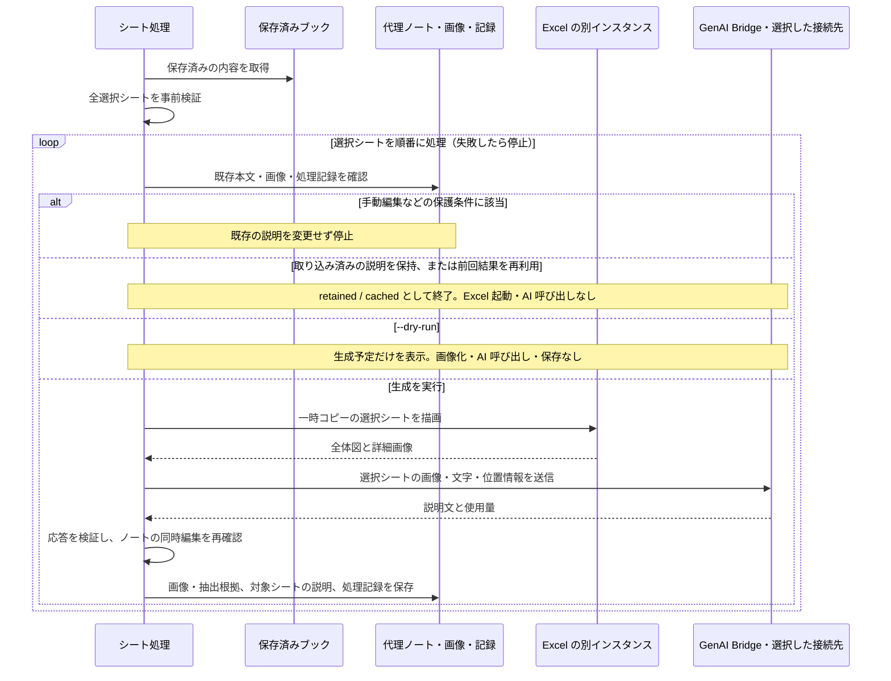

# シート説明と単独 Markdown の生成

代理ノートの作成と基本の同期は [README](../../README.md) を参照してください。ここではシートの AI 解析と単独ファイルへの変換を説明します。

## シートの内容をAI解析してノートに追加する

`context build` コマンドを使うと、Excel の描画画像とセル・図形の文字・位置情報から、シート全体の意味を理解し、代理ノートに説明を追記できます。
解析に使用した画像は、`img` フォルダに保存され、シートの説明文とともに画像リンクとして追加されます。
`context build` コマンドは、通常の `pull` から自動実行されることはありません。

> [!IMPORTANT]
> `context build` は選択シートの画像・文字・位置情報を、GenAI Bridge で選択した接続先へ送信します。
> 送信できる内容か確認してから実行してください。利用枠や料金は接続先・契約によって異なります。

### 準備と実行

Windows、デスクトップ版 Microsoft Excel、画像入力に対応する生成AIの接続先・モデルが必要です。
[tkn_genai_bridge](https://github.com/tuckn/tkn_genai_bridge) 0.10.0 の画像対応リビジョンを依存関係として固定しています。
画像入力の接続先は Codex、Claude Code、GitHub Copilot、Antigravity、Ollama、Azure OpenAI に対応しています。
各接続先で画像対応モデルを選択してください。GitHub Copilot は `--attachment` 対応の CLI が必要です。
既存環境は、このリポジトリで `uv tool install . --reinstall` を実行して依存関係も更新してください。
既定の `codex-default` は、ログイン済みの Codex CLI を利用します。モデル・推論量・タイムアウトは共有プロファイルから読み込みます。
GenAI Bridge の組み込み既定ではモデル・推論量は未指定、タイムアウトは300秒です。必要に応じて共有設定を変更してください。
CLI は[通常のインストール](../../README.md#インストールする)で準備できます。シート画像の生成にはデスクトップ版 Microsoft Excel が必要です。

接続先は `~/.tkn/genai_bridge/config.yaml` に設定します。
共有設定の作成方法は [GenAI Bridge のセットアップ](https://github.com/tuckn/tkn_genai_bridge#セットアップ) を参照してください。
このアプリ側ではプロファイル名と必要な上書きだけを指定します。

```yaml
generation:
  bridge_profile: codex-default
  overrides:
    timeout_seconds: 600
```

`generation.bridge_profile` を共有設定のプロファイル名へ変更すると接続先を切り替えられます。
Bridge の設定例には `claude-default`、`copilot-default`、`antigravity-default`、`azure-quality` があります。
ローカルの画像処理には組み込みの `local-vision`（Ollama / `qwen3.5:9b`）も選べます。Ollama とモデルは別途準備してください。

`generation.overrides` は共有プロファイルより優先します。接続先・認証は共有設定で管理し、アプリ固有の上書きだけを記載してください。
通常の同期と `workbook list-sheets` では共有プロファイルを解決せず、AIを呼び出しません。

説明を生成する前に、`pull` で代理ノートを作成してください。シート一覧の確認には代理ノートは不要です。
以下の `example.xlsx` と `Sheet1` は、対象ブックの相対パスと実際のシート名に置き換えます。
まず保存済みのシート一覧を確認します。この操作は読み取り専用です。

```shell
tkn-excel-catalog workbook list-sheets --source catalog --workbook "example.xlsx"
```

生成前の検証は、次のコマンドで行います。

```shell
tkn-excel-catalog context build --source catalog --workbook "example.xlsx" --sheet "Sheet1" --dry-run
```

保存済みブック、シート選択、既存ノート、再利用・手動編集の保護条件を確認します。生成対象では共有プロファイルと画像対応の接続先も検証し、結果の `bridgePlan` に解決した生成条件を含めます。
ファイルの保存、Excel の起動、画像化、認証、AI 呼び出しは行いません。
画像数とトークン数は、この段階では確定できません。

説明を生成してノートへ追加します。

```shell
tkn-excel-catalog context build --source catalog --workbook "example.xlsx" --sheet "Sheet1"
```

`--sheet` は完全一致の名前で繰り返し指定できます。
`--all-sheets` は表示中の全シートを選び、非表示シートは名前を明示した場合だけ対象になります。
未対応のシート種別が含まれる場合は、AI を呼ぶ前に拒否します。
相対ブックパスは選択 source の入力ルート基準です。絶対パスでも、その範囲内で `include` / `ignore` の条件を満たす必要があります。
全シートを事前検証した後に順番に処理し、最初の失敗で停止します。先に成功したシートは残ります。

生成後はノート内の説明を元シートと見比べてください。
小さな文字、矢印の接続先、埋め込みオブジェクト、説明のない色などは誤って解釈される場合があります。
生成指示では原文と推測を区別させますが、結果の正確さを保証するものではありません。

### 生成と再利用の流れ

`context build` が選択したシートを処理する流れです。
最初に全シートを事前検証し、その後はシートごとに既存の説明・画像・処理記録を確認します。



図は `--force` を付けない場合の代表的な分岐です。
`--force` は既存本文の置き換えと再生成を明示する指定ですが、生成中の同時編集は保護します。
描画や AI 応答の検証に失敗した場合は既存ノートを維持し、先に成功したシートの結果は残します。
使用量の記録は AI 呼び出し時に行うため、ノートを更新できなかった実行にも残る場合があります。

### 保存済みの内容と画像化

Excel を開いたままでも、最後に保存された内容を読み取ります。
画面上の未保存の編集は対象外です。
Windows の共有読み取りを使い、取得中の保存を検出した場合は再実行を案内します。

一時コピーを別の Excel インスタンスで開き、マクロ・イベント・リンク更新、自動再計算、起動時の外部データ更新を抑止して描画します。
元ブックやユーザーの Excel を変更・終了せず、一時コピーは保存せず閉じます。
Excel 4 マクロシートや、UTF-8 以外のブック・接続情報 XML は画像化できません。

表示中のセル、結合セル、図形から描画範囲を決め、UsedRange や印刷範囲外の図形も対象にします。
PDF は画像化のための一時形式です。保存済みの印刷範囲をそのまま使わず、描画する領域ごとに一時コピーの印刷範囲を設定し直して Excel から PDF に出力し、PNG に変換します。元ブックの印刷設定は変更しません。
Excel が必要なのは PDF 形式のためではなく、表示文字列やセル・図形の位置、はみ出す文字の幅を Excel から取得し、その描画結果を使うためです。外部の PDF プリンターだけではブックを解釈・描画できません。別の表計算ソフトによる PDF 化は可能ですが、この CLI は対応しておらず、Excel と同じ画像になる保証もありません。
詳細画像は一部を重ねて分割し、上から下、同じ高さでは左から右に並べます。
全体図も付け、必要なら全体図の PDF ページを連結します。
極端に離れた領域は座標付きの詳細画像にし、詳細領域が想定外に複数ページとなる場合は欠落を避けるため停止します。
AI には領域を Z 字順に読み、矢印・色・配置を解釈するよう指示します。

### 保存先と手動編集の保護

各シートの文章は `context-<sheetId>` 管理セクションに保存します。
Frontmatter、セクション外の文章、他シートの説明は保持します。通常の `pull` もこの説明を保持します。
画像と抽出根拠は、ノートと同じ階層の固定の `img` フォルダに保存します。

```text
example.xlsx.md
img/
  <book-key>/sheet-<id>/<generation>/
    001.png
    002.png
    evidence.json
```

Markdown 内のリンクは相対パスです。移動時はノートと `img` を一緒に扱ってください。
サブフォルダのノートも、そのノートと同階層の `img` を使います。
識別子でブック・シート間の衝突を防ぎ、古い画像は自動削除しません。
PDF とブックのコピーは一時ファイル、PNG と抽出根拠の JSON は保存対象です。

シート内容、関連する内部データ、描画設定、GenAI Bridge が解決した生成条件・バージョン、出力スキーマ、生成指示の版が同じで、画像と生成本文が保持されていれば、前回の結果を再利用します。共有プロファイルでモデルを変更した場合も再生成の対象です。
この場合、Excel の起動も AI 呼び出しもなく、トークン消費は 0 です。
共有書式の変更は複数シートの再生成につながる場合があります。無関係なセル文字列の変更は通常影響しません。

> [!WARNING]
> `context build --force` は前回結果を再利用せず、指定したシートの管理セクション内の手動編集や、取り込み済みの説明も生成文で置き換えます。

通常は手直しや対応する記録の欠落を検出すると既存本文を保護します。
生成中にノートが編集された場合は、`--force` でも上書きせず停止します。

処理記録と使用量は `~/.tkn/excel_catalog_pipeline/state/context/` に保存します。
ノート単位のロックで同時生成を防ぎます。強制終了後のロックは、処理が動いていないことを確認してから除去してください。
AI 呼び出しは自動再試行しません。失敗・タイムアウト・不正な応答では既存ノートを保持します。
保存途中の失敗で未使用の画像が残る場合があります。

### 使用量と生成設定

呼び出しごとの入力・出力・キャッシュ入力・推論トークンと所要時間を表示し、結果 JSON にその実行の合計を含めます。
キャッシュ入力は入力の内数、推論トークンは出力の内数なので重複加算しません。
トークン集計はGenAI Bridgeに委ねます。Codexでは完了ターンの使用量を扱い、累積イベントを重複加算しません。
不明・中断時は `unknown` / `null` とし、判明した部分的な使用量は記録します。
使用量の記録にはGenAI Bridgeの実行記録、画像ハッシュ、共有プロファイル名、生成条件のハッシュも含めます。生成指示の本文、生成本文、画像本体、認証情報は保存しません。失敗してもGenAI Bridgeから返った使用量と既知の小計を保持します。参考単価が共有設定にある場合は、GenAI Bridgeが計算した参考額も実行記録に残ります。画像化前のdry-runではトークン数・金額を見積もりません。

設定ファイルのトップレベル `generation` で生成条件を変更します。省略時は以下の値です。

| キー（`generation.` 以下）                      | 既定値             | 意味・単位                                           |
| ---------------------------------------------- | ------------------ | ---------------------------------------------------- |
| `bridge_profile`                             | `codex-default`  | GenAI Bridge共有設定のプロファイル名                 |
| `overrides`                                  | `{}`             | 共有プロファイルに重ねるアプリ固有の設定             |
| `language`                                   | `Japanese`       | 生成文の言語                                         |
| `max_images`                                 | `24`             | 1 シートの全体図を含む画像数の上限。最大`100`      |
| `tile_width_points` / `tile_height_points` | `1200` / `800` | 詳細画像の幅・高さ。Excel のポイント単位             |
| `overlap_points`                             | `80`             | 隣接画像の重なり。幅・高さの小さい方の半分未満       |
| `image_dpi`                                  | `150`            | 画像の解像度。`72`～`300` dpi                    |
| `max_cells` / `max_objects`                | 各`10000`        | 1 シートの抽出対象セル・オブジェクト数の上限         |
| `max_input_chars`                            | `200000`         | シートの抽出根拠・送信内容の文字数上限               |
| `max_workbook_mb`                            | `100`            | 入力ブックのサイズ上限。1 単位は 1024 × 1024 バイト |

描画・抽出の数値項目は正の整数です。`overrides` 内はGenAI Bridgeの設定仕様に従います。
上限を超えた場合は内容を切り捨てずエラーにします。対象と必要量を確認してから設定を変更してください。
条件の変更により、前回の生成結果を再利用できなくなる場合があります。

## Excel を単独の Markdown に変換する

生成 AI の回答用 context として使う場合は `export` を実行します。
`source` 登録、`pull`、代理ノート、同期記録は不要です。入力は `.xlsx` / `.xlsm` です。
Windows・デスクトップ版 Excel・GenAI Bridge の画像対応接続先が必要です。
接続先の設定は[AI 接続の準備](#準備と実行)を参照してください。

```powershell
tkn-excel-catalog export "C:\path\to\example.xlsx" --output "C:\path\to\example.md" --dry-run
tkn-excel-catalog export "C:\path\to\example.xlsx" --output "C:\path\to\example.md" --profile default-ja
tkn-excel-catalog export "C:\path\to\example.xlsx" --output "C:\path\to\example.en.md" --profile default-en
```

- 既定は表示中の全ワークシート。`--sheet "Sheet1" --sheet "Sheet2"` で選択でき、非表示シートも名前の明示で対象にできます。
- 保存済み内容をシート単位で画像解析し、その説明文からブック全体の概要・シート間の関係・不明点を生成します。AI 呼び出しは選択シート数 + 1 回です。統合処理は生成済みの文章を読み、画像を再解析しません。
- 元 Excel は変更しません。Markdown 本文は概要と各シートの詳細を含みます。同じフォルダの `excel-assets-<実行ID>/` に根拠画像・抽出情報・出典情報を保存します。画像も参照する場合は Markdown と一緒に移動してください。
- 既存 Markdown は `--force` を明示した場合だけ置き換えます。途中で生成に失敗した場合は完成版を公開せず、既存 Markdown を保持します。過去の根拠画像は削除しません。
- `--dry-run` は読み取り・設定検証のみで、Excel 起動・画像化・AI 呼び出し・保存は行いません。画像数・トークン数は実行まで確定しません。
- 通常実行では選択シートの情報と画像を設定済み AI 接続先へ送信します。使用量記録はアプリの `state/export/usage/` に保存します。同期状態は作成しません。
- シートの抽出情報および統合対象の説明文には `generation.max_input_chars` の上限を適用します。超過時は切り捨てず停止します。統合段階で超過した場合、それ以前のシート解析の利用量は発生します。

### 生成プロンプトのプロファイル

`--profile` は文章の作り方・出力言語を選びます。AI 接続先を選ぶ `generation.bridge_profile` とは別です。
`context build` でも同じ `--profile default-ja` / `default-en` を利用できます。

```yaml
generation:
  prompt_profile: default-ja
  bridge_profile: codex-default
```

既定の `prompt_profile: auto` は従来の `generation.language` を維持します。
`default-ja` / `default-en` を明示すると日本語 / 英語が優先されます。
プロンプトは以下に同梱してあり、将来のプロファイル追加の基点となります。現時点で指定可能なのはこの2種類です。

```text
src/excel_catalog_pipeline/context_profiles/
  default-ja/
    prompt.md           # シートの画像解析
    workbook-prompt.md  # ブック全体の統合
  default-en/
    prompt.md
    workbook-prompt.md
```

プロンプトの変更はハッシュで追跡し、`context build` の再利用判定にも反映します。
同梱ファイルを編集した後は `uv tool install . --reinstall` でインストール済み CLI に反映してください。
