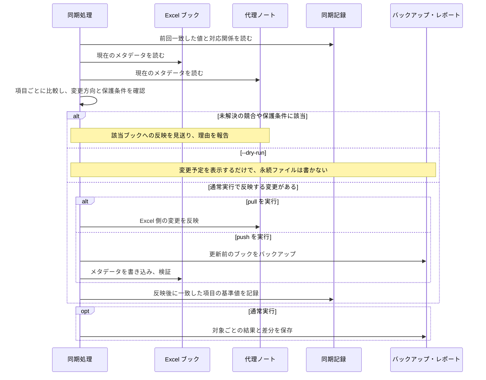

# 同期と実行結果

## メタデータの対応

| 代理ノートの項目   | Excel 側の値・用途                                                   |
| ------------------ | -------------------------------------------------------------------- |
| `title`          | タイトル（Title）                                                    |
| `subject`        | 件名（Subject）                                                      |
| `author`         | 作成者（Author / creator）。単一文字列です。                         |
| `keywords[]`     | キーワード（Keywords / tags）                                        |
| `categories[]`   | 分類（Category）                                                     |
| `comments`       | コメント（Comments / description）                                   |
| `sourceCreated`  | Excel の作成日時。`pull` だけで更新します。                        |
| `sourceModified` | Excel の更新日時。`pull` だけで更新します。                        |
| `sourceFileName` | 入力ルートからの相対パス。編集すると名前変更・移動の要求になります。 |
| `sourceFullPath` | 元ブックの絶対パス。名前変更の要求には使いません。                   |
| `description`    | 代理ノート全体の概要。Excel には反映しません。                       |
| `schemaVersion`  | 代理ノートの形式の版。現在は文字列`"2.1"` です。                   |

`keywords` と `categories` は、Excel へ戻すときに Obsidian のリンク記法を外し、`; ` で結合します。
カンマは用語の一部として保持します。
`push` ではノート側の `sourceCreated` / `sourceModified` を Excel へ書かず、ノートの現在値も保持します。

生成する `type`、元ファイルの日時、`date`、`updated`、`noteId` は引用符なしの YAML 値、`schemaVersion` は引用符付き文字列です。
AI 説明の鮮度と対象範囲は `contextStatus`、`contextAnalyzedSheets`、`contextOmittedSheets`、`contextGeneratedAt`、`contextSourceFingerprint` に記録します。[状態の意味](../guides/sheet-content.md#説明の状態)を参照してください。これらは Excel へ書き戻しません。
本文の管理部分は既存ノートとの継続性のため `excel-catalog` マーカーで囲みます。
未知の Frontmatter 項目と、マーカー外の手書き本文は保持します。
`files` は同期に使用せず、自動追加しません。既存ノートにある場合は、その値を保持します。


## 比較から反映までの流れ

既存のブックと代理ノートを同期するときのやり取りを示します。
矢印は読み取り・書き込みなどの要求と応答、枠は実行条件による分岐です。
実行コマンドの方向へ反映できる変更だけを適用します。



初回の `pull` は新しい代理ノートと同期記録を作成します。
図は名前変更の処理と、書き込み失敗時の復元処理を省略しています。それぞれ[名前変更と移動](#名前変更と移動)、[Excel への書き込みの保護](#excel-への書き込みを保護する仕組み)を参照してください。
競合や失敗があっても、ほかの対象ですでに成功した変更は残ります。

## 競合の判定と解決

たとえば前回のタイトルが「製品比較」で、Excel だけを「製品比較 2026」に変えた場合は `pull` の対象です。
ノートだけで変えた場合は `push` の対象です。
両方で別のタイトルに変えた場合は、更新日時だけで優先側を決めず、競合として報告します。

この判定には、前回 Excel とノートが一致した値を保存した同期記録（`sync-state.json`）を使います。
現在の Excel、現在のノート、前回の一致値を項目ごとに比べる方式です。
通常実行後も、実際に一致した項目だけを基準値として更新します。
反対方向の未反映の変更は、次の操作に引き継ぎます。
同期記録がなく、既存の Excel とノートの値が異なる場合も競合になります。

競合の内容は、全体オプション `-v` またはレポートの `differences.csv` で確認します。
Excel を正としてノートをそろえる場合は、次の順で実行します。

> [!WARNING]
> `pull --prefer-source` は、ノートだけで編集した項目も Excel の値で置き換えます。
> プレビューで対象と差分を確認してから通常実行してください。

```shell
tkn-excel-note -v pull --source workbooks --prefer-source --dry-run
tkn-excel-note pull --source workbooks --prefer-source
```

通常の `pull` はその編集を保持します。
ノートを正として競合を解決する場合は、`push --prefer-note` を指定します。
いずれも対象と差分を確認してから使い、`--prefer-source` と `--prefer-note` は同時に指定しません。

## 名前変更と移動

ブックを移動しても識別しやすくするため、`adopt` で未付与のブックに固定 ID（カスタムプロパティ `TknExcelCatalogId`）を付けられます。
初回の `pull` の必須手順ではありません。
通常実行はバックアップ後にブックを書き換えるため、ID の付与が目的の場合に実行します。

```shell
tkn-excel-note adopt --source workbooks --dry-run
tkn-excel-note adopt --source workbooks
```

名前変更・移動には、次の 2 方向があります。

| 先に変更する場所                         | CLI が変更する対象                         | 必要な指定                                                      |
| ---------------------------------------- | ------------------------------------------ | --------------------------------------------------------------- |
| エクスプローラーなどで元ブックを移動する | 代理ノートを元ブックの相対パスへ追従させる | `rename_adapter: filesystem` と通常の `pull`                |
| ノートの`sourceFileName` を編集する    | 元ブックと代理ノートを移動する             | `rename_adapter: filesystem` と通常の `push --allow-rename` |

既定の `report-only` はパスを変更せず、必要な移動を `rename-required` として報告します。
`filesystem` の設定だけでは移動せず、対応するコマンドの通常実行が必要です。
プレビューには `--dry-run` を追加します。`push` のプレビューでも `--allow-rename` を残すと、通常実行と同じ移動先の検証を行えます。

移動先は入力ルート内の有効な相対パスで、拡張子を保ち、既存ファイルと衝突しない必要があります。
`filesystem` は Obsidian の被リンクを更新しません。
被リンクの維持が必要なら `report-only` で報告を確認し、Obsidian 上での手動操作を検討してください。

現在のパスと理由は画面に表示し、通常実行では `actions.csv` と `details.json` にも記録します。
`pull` の希望移動先と衝突情報は `details.json`、`push` の希望相対パスは編集した `sourceFileName` で確認します。
プレビューではレポートを作らないため、項目単位の比較には `-v` を使います。

## Excel への書き込みを保護する仕組み

- 上書き前に元ブックをバックアップします。
- OS のアプリケーション用一時フォルダで OOXML の更新内容を組み立て、対象のメタデータだけを書き換えます。
- VBA と、変更対象ではない ZIP 内の項目を保持します。
- 上書き前後に ZIP の整合性とプロパティを読み直して検証します。
- ファイル自体を別ファイルに置き換えず内容を上書きし、ファイルの識別情報と作成日時を維持します。
- 上書きや事後検証に失敗した場合は、バックアップの内容と日時の復元を試みます。
- デジタル署名付き OOXML への書き込みは拒否します。ロックなどで安全に上書きできない場合も失敗として扱います。

## 結果の読み方

### 画面表示と出力形式

進捗や結果の集計は、標準エラー出力へ `[LEVEL] message` の形で表示します。
`pull` は変更などがあるノートの絶対 `notePath` と相対 `sourcePath` を表示します。
`push` は冒頭に入力・ノート設定を表示し、処理結果をノート名と相対 `sourcePath` で表示します。
`unchanged` は個別表示せず、最後の集計に件数を出します。
`missing-source` は元ブックが見つからないため `sourcePath` がなく、ノート名だけを表示します。

同期コマンドは標準出力に 1 行のコンパクトな結果 JSON を返します。

| コマンド | 標準出力 | 保存される実行結果 |
| --- | --- | --- |
| `status`、通常の `pull` / `push` / `adopt` / `delete-notes` | 1 行の結果 JSON | 実行レポート。書き込み時のバックアップは各処理の仕様に従います。 |
| `--dry-run` | 1 行の結果 JSON | 保存しません。予定・理由・競合を画面で確認します。 |
| `config show` | 設定ファイルの見出しとインデント付き JSON | 保存しません。出力全体は単独の JSON ではありません。 |
| `config init` / `workbook list-sheets` | 1 行の結果 JSON | 前者は設定を作成し、後者は読み取り専用です。 |

`pull --context` の結果 JSON にはその実行の `usage` を含めます。対象別の生成・再利用結果は実行レポートの `details.json` に記録します。

`-v` / `--verbose` は Excel・ノート・基準値・予定方向の詳細を表示します。
`--quiet` は情報ログを抑制し、`--no-color` または環境変数 `NO_COLOR` は色を無効にします。
これらはサブコマンドの前に指定します。

### 状態と次の操作

| 状態                                  | 意味・次の操作                                                                         |
| ------------------------------------- | -------------------------------------------------------------------------------------- |
| `unchanged`                         | 同期対象の差分がありません。                                                           |
| `would-create` / `would-update`   | `pull --dry-run` でのノート作成・更新予定です。対象を確認して通常実行します。        |
| `created` / `updated`             | ノートを作成・更新しました。                                                           |
| `would-write` / `written`         | Excel への書き込み予定／書き込みと検証の完了です。                                     |
| `would-adopt` / `adopted`         | 固定 ID の付与予定／付与の完了です。                                                   |
| `missing-source`                    | 元ブックが見つからない、または一意に対応しません。意図的な削除後の整理は [`delete-notes`](../guides/catalog-operations.md#元ブックがない代理ノートを削除する) を使います。 |
| `would-delete` / `deleted` | 元ブックがない代理ノートと対応する同期記録の削除予定／削除完了です。 |
| `delete-error` | 存在するブック、曖昧な対応、読み取り・書き込み失敗などにより削除できません。理由とバックアップを確認します。 |
| `skipped-note` | 一括削除で別の source に属するノートを対象外にしました。 |
| `missing-note`                      | 追跡済みのノートがありません。`pull` の作成予定を確認します。                        |
| `pull-required` / `push-required` | 反対方向に未反映の変更があります。該当方向のプレビューで確認します。                   |
| `conflict`                          | 両側の変更や基準値の欠落で競合しています。[競合の解決](#競合の判定と解決)を参照します。 |
| `duplicate-id`                      | 複数のブックに同じ固定 ID があります。対応付けを確認します。                           |
| `rename-required`                   | 名前変更・移動に必要な設定や許可を確認します。                                         |
| `rename-error`                      | 移動先の名前、衝突、ファイル操作の失敗を確認します。                                   |
| `generation-error` | AI の事前検証・描画・生成・保存に失敗しました。途中までの更新が残る場合があります。[生成処理](../guides/sheet-content.md)を参照してください。 |
| `read-error` / `write-error`      | 読み取り／書き込み・事後検証に失敗しました。表示理由とバックアップを確認します。       |

終了コードは、通常 `0` が成功、`1` が実行・検証・部分的な書き込みエラー、`2` が未解決の競合、`3` が設定・対象選択などのエラーです。
引数の構文エラーも引数解析処理が `2` を返すため、画面のメッセージと合わせて判断します。
また、`rename-required` などが残っていても終了コード `0` になることがあります。
`statusCounts` と対象ごとの状態を確認してください。

### レポートと同期記録の保存先

実行レポートは、ノートの内容とは別の、処理結果の記録です。
`status` と通常の同期コマンドは、次のファイルを作成します。

```text
~/.tkn/excel_note/state/runs/<run-id>/
  summary.json
  actions.csv
  details.json
  differences.csv
```

| ファイル            | 確認できること                                                                               |
| ------------------- | -------------------------------------------------------------------------------------------- |
| `summary.json`    | 全体の状態、変更・競合・エラー件数、状態別件数                                               |
| `actions.csv`     | ファイルごとの結果、対象パス、変更項目、理由                                                 |
| `details.json`    | ファイルごとの詳細情報                                                                       |
| `differences.csv` | 項目ごとの前回一致値`baseValue`、Excel 値 `excelValue`、ノート値 `noteValue`、変更方向 |

`sourceToNoteFields` は Excel からノート、`noteToSourceFields` はノートから Excel への変更項目です。
`changedFields` は、そのコマンドで反映した、または反映予定の項目です。
`differences.csv` の `direction` は比較による変更方向、`plannedDirection` は優先指定も含めた適用予定方向です。
空欄で値を消す変更も、ここで確認できます。

全体オプション `--report-dir` でレポートの親フォルダを変更できます。
同期の `--dry-run` ではこの指定は無効で、レポートを作りません。
`pull --context` の結果も同じ実行レポートに含めます。AI の保護・再利用・使用量記録は `state/context/` に別途保存します。

継続利用するデータは、次のように扱います。

| 保存領域                                      | 内容・失った場合の影響                                                                                                               |
| --------------------------------------------- | ------------------------------------------------------------------------------------------------------------------------------------ |
| `sources.<id>.workbooks_dir`                                | 元の Excel ブックです。代理ノートだけでは元の内容を復元できません。                                                                  |
| `notes.dir`                                | 代理ノートと、シート説明の画像です。手書き本文や過去に取り込んだ説明を含むため、元ブックと別に保持します。                             |
| `~/.tkn/excel_note/config.yaml` | 入出力先などの設定です。入力・保存先の指定を保持します。                                                                   |
| `state/sync-state.json`                     | ブック・ノートの対応と前回一致値です。失うと、既存の差分を競合として扱うことがあります。手編集や安易な削除を避けてください。         |
| `state/backups/`                            | Excel 更新前のバックアップです。過去の内容への復旧に使います。                                                                       |
| `state/runs/`                               | 各実行のレポートです。削除するとその実行の調査記録を失います。                                                                       |
| `state/context/`                            | シート説明の保護・再利用用の記録、過去の取り込み時のバックアップ、使用量の記録です。欠落時は既存の説明の置き換えを保護することがあります。 |

上表の `state/` は `~/.tkn/excel_note/state/` です。旧版からは設定・同期記録・バックアップを含むフォルダ全体を移行します。[移行手順](../../README.md#旧版から更新する)を参照してください。
環境を移す場合は、元ブック、ノートと画像、設定、同期・シート処理の記録を一緒に保全してください。
ノートには元ファイルの絶対パスや抽出した本文が入り、レポートにもパスやメタデータが入ります。
実データを含む生成物を公開リポジトリへ追加しないでください。
